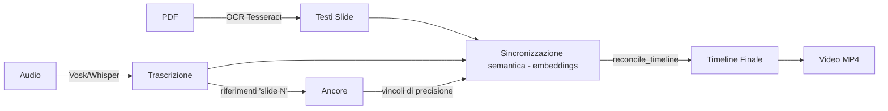

# Slide2Video 🎬

Sincronizza automaticamente una presentazione PDF con un podcast audio e genera un video in cui ogni slide appare al momento giusto.

**Pipeline:** PDF → OCR → Trascrizione (Vosk/Whisper) → Ancore "slide N" → Sincronizzazione semantica (embeddings) → Video MP4



---

## 🚀 Avvio rapido

```bash
# Opzione 1: Doppio click su genera_video.bat

# Opzione 2: Terminale
python main.py

# Il bootstrap installa automaticamente TUTTE le dipendenze:
# pacchetti pip, Tesseract OCR, ffmpeg, modelli ML
# Output: video_finale.mp4
```

> **Precisione assoluta**: il programma non distribuisce mai le slide uniformemente. La timeline viene costruita dal **solo** allineamento semantico (embeddings offline, senza LLM), vincolato dai riferimenti espliciti "slide N" nella trascrizione. Se non è generabile → **interruzione con avviso**.

### 🔀 Flussi supportati

| Flusso | Segnale nell'audio | Esempio |
|---|---|---|
| `slide-audio` | *"Passiamo alla slide 3"* | Speaker nominano il numero slide: in cifre (*"slide 3"*), in cardinali (*"slide tre"*) o in ordinali (*"la terza diapositiva"*, *"la sesta slide"*) |
| `audio-slide` | *"Passiamo al blocco successivo"* | Dibattito, poi slide generate dopo |
| `free` | nessuno (riordino libero) | Dibattito che salta tra i temi senza nominare le slide: il sistema mostra di volta in volta la slide semanticamente più vicina, in qualsiasi ordine e anche ripetuta |

Override manuale: `python main.py --flow audio-slide` oppure `python main.py --flow free`

> **Auto-detection automatica**: il sistema sceglie da solo. Se il podcast segue
> i vincoli del prompt NotebookLM (`slide N` o `blocco successivo`) usa il flusso
> ordinato corrispondente e rispetta le ancore; se NON segue il prompt (nessun
> segnale), usa automaticamente il riordino libero `free`.
>
> **Flusso `free`**: ideale quando il podcast non segue l'ordine delle slide
> (es. dibattiti). Per ogni blocco audio mostra la slide più vicina per contenuto,
> in qualsiasi ordine e anche ripetuta, con anti-flicker (durata minima dei
> segmenti, ~8s) e avviso sulle slide mai menzionate.

### 🤖 Selezione con LLM (opzionale, supera il tetto del MiniLM)

Il MiniLM locale ha un tetto di precisione (~50%) quando le slide sono
semanticamente simili tra loro (stesso tema). Un LLM che legge slide +
trascrizione INSIEME comprende il significato e può associare meglio la slide
ai momenti del podcast (es. "covert" → slide Overt/Covert).

- Unico provider: **9Router** online (localhost:20128). Modello principale:
  la **combo `comboact`** (46 modelli free mantenuti dallo script
  `9router-maintenance/update-comboact.ps1`: Gemini, Kimi, DeepSeek, Nemotron,
  GLM, Qwen, ecc.). Inviando `"model": "comboact"` il router instrada il primo
  modello funzionante, con backup espliciti Cloudflare Mistral 24B → Gemma
  4 31B it (free) → fallback **MiniLM**. Nessuna interruzione. Modelli e URL
  sovrascrivibili con `LLM_9ROUTER_MODEL`, `LLM_9ROUTER_BACKUP_MODEL`,
  `LLM_9ROUTER_BACKUP_MODEL_2`, `LLM_9ROUTER_URL`, `LLM_9ROUTER_API_KEY`.
- Due usi, in base al flusso:
  1. **Flusso libero** (`free`): sceglie la slide per ogni chunk audio.
  2. **Flusso ibrido ordinato** (`slide-audio`/`audio-slide`): posiziona SOLO
     le slide **senza ancora esplicita** "slide N", rispettando alla lettera
     le ancore deterministiche. Risolve il caso in cui il MiniLM inventa
     durate per slide mai nominate o narrate fuori posizione.
- Configurabile: `--llm auto|off|9router`, `--llm-model`, `--llm-chunk`.
- La risposta LLM viene cachata (hash slide+audio+chunk+modelli+ancore): non
  si ripaga a ogni run, e cambiando `--llm-model` la cache viene rigenerata
  (niente risultati di un altro modello). Nota: il supporto a **LM Studio**
  (modelli locali come `qwen2.5-7b-instruct` o `gemma-4-12b-it`) è stato
  rimosso: inadatti al flusso libero sulla macchina di sviluppo.

```bash
# Attiva la selezione LLM (default: auto)
python main.py --llm auto --preview     # valuta senza generare video
python main.py --llm 9router           # forza 9Router online
```

> **Consiglio**: nominare la slide quando si cambia argomento (*"passiamo alla slide 3"*) regala ancore deterministiche ad alta precisione. Senza di esse il semantico allinea comunque per contenuto. Prompt ottimale per NotebookLM: [`PROMPT_NOTEBOOKLM.md`](PROMPT_NOTEBOOKLM.md).

#### Manutenzione 9Router (`9router-maintenance/`)

La cartella `9router-maintenance/` contiene uno script PowerShell
(`update-comboact.ps1`) che mantiene la **combo `comboact`** esposta da 9Router:
testa in parallelo i modelli, rimuove quelli guasti/morti e aggiunge modelli
free. Serve a mantenere pulito il router lato server.

> **La combo `comboact` è il modello principale della pipeline**: `llm_sync.py`
> invia `"model": "comboact"` a `/v1/chat/completions`, così il router instrada
> automaticamente il primo modello funzionante della combo mantenuta dallo
> script. **Esegui `mantenimento-comboact.bat` periodicamente** (es. una volta
> a settimana, o quando il router segnala modelli guasti) per tenere la combo
> sana: la pipeline consuma direttamente il suo contenuto.
>
> Backup espliciti della stessa combo (se la combo risponde con errori):
> Cloudflare Mistral 24B → Gemma 4 31B it (free). Sovrascrivibili con
> `LLM_9ROUTER_BACKUP_MODEL` / `LLM_9ROUTER_BACKUP_MODEL_2`. Per usare un
> modello singolo invece della combo: `LLM_9ROUTER_MODEL=<modello>` o
> `--llm-model <modello>`.


---

## 🖥️ Primo avvio su un altro PC

1. **Installa Python 3.10+** da [python.org](https://python.org) — spunta **"Add Python to PATH"**.
2. **Copia la cartella** `sync_video_portable` sul nuovo PC.
3. **Aggiungi i tuoi file**: `presentazione.pdf` e `podcast.m4a` nella stessa cartella.
4. **Lancia `genera_video.bat`** — tutto il resto è automatico.

### Cosa viene installato automaticamente al primo avvio

| Componente | Dimensione | Metodo |
|---|---|---|
| Pacchetti pip (10) | ~200 MB | `pip install` |
| Tesseract OCR | ~40 MB | `winget` / `apt-get` / `brew` |
| ffmpeg | ~80 MB | `winget` / `apt-get` / `brew` |
| Modello embedding MiniLM | ~240 MB | fastembed (download automatico) |
| Modello Vosk italiano | ~1.5 GB | Download da alphacephei.com |
| Lingua Tesseract ITA | inclusa | `tessdata/ita.traineddata` |

> **Alternativa Whisper**: `python main.py --transcriber whisper` — usa faster-whisper (~500 MB) invece di Vosk. Qualità spesso superiore.

---

## 🎮 Comandi

```bash
# Default (cerca presentazione.pdf + podcast.* nella cartella)
python main.py

# File personalizzati
python main.py --pdf slides.pdf --audio registrazione.mp3

# Anteprima timeline (niente video)
python main.py --preview

# Dry-run: genera timeline senza produrre video
python main.py --dry-run --debug

# Forza nuova analisi (ignora cache)
python main.py --no-cache

# Whisper invece di Vosk
python main.py --transcriber whisper --whisper-model medium

# Esegui i test (106 unit test: pipeline, LLM, chunks, integrazione)
python -m unittest test_sync test_integration test_llm_sync test_chunks
```

### Opzioni principali

| Opzione | Default | Descrizione |
|---|---|---|
| `--pdf` | `presentazione.pdf` | PDF o PPTX |
| `--audio` | auto | File audio (mp3/m4a/wav) |
| `--output` | `video_finale.mp4` | File video output |
| `--flow` | auto-detect | `slide-audio` o `audio-slide` |
| `--dry-run` | — | Solo timeline, niente video |
| `--preview` | — | Mostra timeline e esci |
| `--no-cache` | — | Ignora cache |
| `--debug` | — | Log dettagliato |
| `--transitions` | `0.0` | Dissolvenza tra slide (s) |
| `--lang` | `ita` | Lingua OCR |
| `--transcriber` | `vosk` | `vosk` o `whisper` |
| `--whisper-model` | `small` | tiny/base/small/medium/large |
| `--semantic-model` | MiniLM | Modello embedding |
| `--semantic-window` | `4.0` | Secondi per blocco |
| `--semantic-min-duration` | `3.0` | Durata minima slide (s) |
| `--semantic-temperature` | `0.15` | Competizione softmax (più bassa = picchi più netti) |
| `--llm` | `auto` | Selezione slide con LLM: `auto` (9Router online → MiniLM), `off`, `9router`. Libero: slide per chunk. Ordinato: solo le slide senza ancora esplicita |
| `--llm-model` | — | Override modello LLM (es. `comboact`, `cf/@cf/mistralai/mistral-small-3.1-24b-instruct`) |
| `--llm-chunk` | `30.0` | Secondi per chunk inviato all'LLM |
| `--llm-review` | — | Dopo la timeline LLM nel flusso libero, secondo passaggio LLM che ri-verifica la selezione chunk→slide e avvisa (senza modificare la timeline) sui chunk sospetti. Risultato cachato. |

---

## 📁 Struttura progetto

```
main.py                  ← Orchestratore (auto-detection, cache, timing)
config.py                ← Bootstrap auto-dipendenze + costanti + CLI
chunks.py                ← Finestre temporali condivise (semantic_sync + llm_sync)
ocr.py                   ← Fase 1: PDF → immagini → OCR
transcription.py         ← Fase 2: Audio → Vosk/Whisper → trascrizione
timeline.py              ← Ancore "slide N" + riconciliazione timeline
semantic_sync.py         ← Sincronizzazione semantica (embeddings, DP)
llm_sync.py              ← Selezione slide con LLM (9Router) + cache
video.py                 ← Fase 4: Assemblaggio MP4 (1080p)
test_sync.py             ← Suite di test unitari
test_llm_sync.py         ← Test modulo LLM
test_chunks.py           ← Test finestre temporali condivise
test_integration.py      ← Test di integrazione
genera_video.bat         ← Launcher 1-click
requirements.txt         ← Dipendenze pip
ruff.toml                ← Configurazione lint (guardrail di stile)
mypy.ini                 ← Configurazione type-check
PROMPT_NOTEBOOKLM.md     ← Prompt per generare podcast ottimizzati
tessdata/                ← Modelli lingua Tesseract portatili
9router-maintenance/     ← Script manutenzione combo `comboact` di 9Router (vedi sotto)
```

### 🛠️ Sviluppo

Comandi verificati per chi modifica il codice:

```bash
# Test (suite completa, unittest — 106 test)
python -m unittest test_sync test_integration test_llm_sync test_chunks

# Type-check (mypy, 13 moduli sorgente)
python -m mypy .

# Lint (ruff; 6 warning residui sono gli "except Exception" difensivi intenzionali)
python -m ruff check .

# Lint + autofix
python -m ruff check . --fix
```

Il `ruff.toml` esclude le metriche di complessità (PLR09xx, PLC0415) perché
rappresentano il backlog di refactoring, non guardrail di stile: il check
default resta verde. Le 6 segnalazioni `BLE001` sono i `try/except Exception`
volutamente ampi (fallback robusti: LLM irraggiungibile, cache corrotta,
embedding fallito) e non vanno "stretti" senza motivo.

### File generati (temporanei, auto-puliti)

| File | Descrizione |
|---|---|
| `video_finale.mp4` | Output video |
| `transcript_raw.txt` | Trascrizione completa (debug) |
| `temp_slides/` | Slide renderizzate |
| `.cache/` | Cache OCR, trascrizione, embedding |

---

## 🔧 Come funziona

1. **OCR** — Ogni pagina PDF → immagine (DPI 300) → Tesseract.
2. **Trascrizione** — Audio → Vosk (o Whisper) con timestamp al decimo di secondo. Stopword rimosse, parole di transizione ("passiamo", "slide", "blocco"...) preservate.
3. **Auto-detection** — Scansione trascrizione per decidere il flusso (`slide-audio` o `audio-slide`).
4. **Ancore "slide N"** — Riferimenti espliciti → ancore deterministiche ad alta precisione. Riconosce numeri in cifre (*"slide 3"*), cardinali (*"slide tre"*, *"numero due"*), **ordinali** (*"la terza diapositiva"*, *"la quinta slide"*) in entrambi i generi, con articolo o "numero" in mezzo, e varianti fonetiche di trascrizione (*"nonna slide"* → slide 9).
5. **Sincronizzazione semantica** — Embedding (MiniLM via fastembed, offline ONNX) + programmazione dinamica monotona. Assegna ogni blocco audio alla slide semanticamente più vicina, con competizione softmax (temperatura 0.15).
6. **Riconciliazione** — Validazione: tempi crescenti, durate positive, ultima slide entro fine audio. Se invalida → interruzione.
7. **Video** — Slide ridimensionate a 1080p, assemblate con MoviePy (fps=5, buffer 3.0s anti-troncamento).
8. **Pulizia** — File temporanei e cache orfana rimossi automaticamente.

### Come lavora il codice per scenario

Le fasi 1-3 (OCR, trascrizione, auto-detection) sono comuni: da lì la
pipeline prende una strada diversa a seconda del segnale presente nell'audio.

| Scenario | Segnale | Cosa fa |
|---|---|---|
| **A. `slide-audio`** | "Passiamo alla slide 3" | Estratte ancore deterministiche "slide N" (cifre, cardinali o **ordinali**: "la terza diapositiva") → vincoli ad alta precisione. Sincronizzazione semantica (MiniLM offline): ogni blocco audio → slide più vicina, DP monotona. Con `--llm` attivo e slide SENZA ancora → **flusso ibrido**: l'LLM posiziona solo quelle (dove il contenuto è discusso), le ancore restano esatte. Riconciliazione (tempi crescenti, durate positive); se impossibile → **interruzione**. Slide in ordine 1→N. Un log diagnostico distingue riferimenti trovati/usati/scartati e segnala le slide senza ancora esplicita. |
| **B. `audio-slide`** | "Passiamo al blocco successivo" | Stesse ancore (numeriche o ordinali), stessa pipeline ordinata (+ flusso ibrido LLM come in A); la slide cambia sulle transizioni di blocco non numerate. |
| **C. `free`** | nessuno | Riordino libero: la slide segue il contenuto del podcast, anche ripetuta, durata minima ~8s (anti-flicker). **Con LLM** (`--llm auto`): chunk 30s inviati a 9Router (combo `comboact` → Mistral 24B → Gemma 31B), fallback MiniLM se nessuno risponde. **Senza LLM** (`--llm off`): solo MiniLM in modalità libera. `--llm-review` ri-verifica e avvisa senza modificare la timeline. |

Il raggruppamento in finestre temporali è condiviso da `chunks.py`
(`build_windows`): finestre corte (4s) per la semantica, larghe (30s) per
l'LLM; ogni motore filtra e formatta a modo suo.

**In tutte le strade**: timeline → durate → MoviePy (slide 1080p, fps 5,
buffer 3s) → `video_finale.mp4`, con pulizia finale della cache orfana.
Se il segnale è insufficiente il programma **si interrompe con avviso**,
mai inventando distribuzioni uniformi.

### Modello embedding

- **Default**: `paraphrase-multilingual-MiniLM-L12-v2` (384 dim, ~240 MB) — testato A/B su podcast reale, produce transizioni bilanciate e picchi netti.
- **Fallback**: `paraphrase-multilingual-mpnet-base-v2` (768 dim, ~1.0 GB) — usato automaticamente se MiniLM non disponibile.
- **Ambiente**: `EMBEDDING_MODEL` e `EMBEDDING_MODEL_ALTERNATE` sovrascrivibili.

### Processo di input consigliato

Per sincronizzazione perfetta, prepara audio e slide con [`PROMPT_NOTEBOOKLM.md`](PROMPT_NOTEBOOKLM.md):

1. **Podcast**: nomina "slide N" in cifre a ogni transizione, una slide per sezione.
2. **Presentazione**: genera dal podcast (stesso ordine, stessi temi).

Risultato su test reale: 6 ancore deterministiche, durate uniformi ~130s, sincronizzazione perfetta.

---

## 🐛 Troubleshooting

| Problema | Soluzione |
|---|---|
| `TESSERACT OCR NON TROVATO` | Auto-install fallita: installa manualmente da [UB-Mannheim](https://github.com/UB-Mannheim/tesseract/wiki) |
| `TesseractError: language 'ita' not found` | `tessdata/ita.traineddata` è incluso — verifica che la cartella `tessdata/` esista |
| `ModuleNotFoundError` | `pip install -r requirements.txt` |
| Sincronizzazione fallita | Similarità troppo bassa. Verifica che l'audio parli dei contenuti delle slide |
| Timeline sbagliata | Prova `--flow audio-slide` o aggiungi ancore "slide N" nell'audio |
| Audio troncato | Già protetto da fps=5 + buffer 3.0s |
| Video senza audio | `winget install ffmpeg` |
| Slide vecchie nel video | Usa `--no-cache` |
