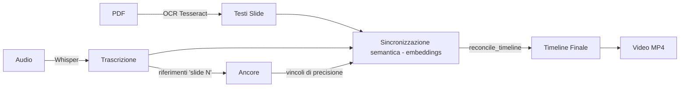

# Slide2Video 🎬

[](https://github.com/riefolog-cyber/sync-video/actions/workflows/ci.yml)

Sincronizza automaticamente una presentazione PDF con un podcast audio e genera un video in cui ogni slide appare al momento giusto.

**Pipeline:** PDF → OCR → Trascrizione (Whisper) → Ancore "slide N" → Sincronizzazione semantica (embeddings) → Video MP4



---

## 🚀 Avvio rapido

```bash
# Opzione 1: Doppio click su genera_video.bat

# Opzione 2: Terminale
python main.py

# Il bootstrap installa automaticamente TUTTE le dipendenze:
# pacchetti pip, Tesseract OCR, ffmpeg, modelli ML
# Output: video_finale.mp4
```

> **Precisione assoluta**: il programma non distribuisce mai le slide uniformemente. La timeline viene costruita dal **solo** allineamento semantico (embeddings offline, senza LLM), vincolato dai riferimenti espliciti "slide N" nella trascrizione. Se non è generabile → **interruzione con avviso**.

### 🔀 Flussi supportati

| Flusso | Segnale nell'audio | Esempio |
|---|---|---|
| `slide-audio` | *"Passiamo alla slide 3"* | Speaker nominano il numero slide: in cifre (*"slide 3"*), in cardinali (*"slide tre"*) o in ordinali (*"la terza diapositiva"*, *"la sesta slide"*) |
| `audio-slide` | *"Passiamo al blocco successivo"* | Dibattito, poi slide generate dopo |
| `free` | nessuno (riordino libero) | Dibattito che salta tra i temi senza nominare le slide: il sistema mostra di volta in volta la slide semanticamente più vicina, in qualsiasi ordine e anche ripetuta |

Override manuale: `python main.py --flow audio-slide` oppure `python main.py --flow free`

> **Auto-detection automatica**: il sistema sceglie da solo. Se il podcast segue
> i vincoli del prompt NotebookLM (`slide N` o `blocco successivo`) usa il flusso
> ordinato corrispondente e rispetta le ancore; se NON segue il prompt (nessun
> segnale), usa automaticamente il riordino libero `free`.
>
> **Flusso `free`**: ideale quando il podcast non segue l'ordine delle slide
> (es. dibattiti). Per ogni blocco audio mostra la slide più vicina per contenuto,
> in qualsiasi ordine e anche ripetuta, con anti-flicker (durata minima dei
> segmenti, ~8s) e avviso sulle slide mai menzionate.

### 📝 Prompt NotebookLM (come generare presentazione e podcast)

Due ricette pronte, in base al punto di partenza:

| Prompt | Flusso | Quando usarlo |
|---|---|---|
| [`PROMPT_NOTEBOOKLM_ PRIMA PRESENTAZIONE (DA PREFERIRE).md`](PROMPT_NOTEBOOKLM_%20PRIMA%20PRESENTAZIONE%20%28DA%20PREFERIRE%29.md) | **A**: deck → podcast con ancore `slide N` | Default: massima precisione di allineamento (ancore esatte), podcast più strutturato |
| [`PROMPT_NOTEBOOKLM_ PRIMA PODCAST.md`](PROMPT_NOTEBOOKLM_%20PRIMA%20PODCAST.md) | **B**: podcast libero → deck derivato dal parlato | Podcast più naturale; anche come piano B quando appare l'avviso "segnale debole" (slide troppo simili tra loro) |

Il flusso A sfrutta le ancore esplicite (flusso ordinato + ibrido LLM); il
flusso B produce slide che rispecchiano 1:1 il parlato e funziona bene col
riordino semantico (`free`/ordinato senza ancore), ma i confini sono stimati e
meno precisi al secondo.


### 🤖 Selezione con LLM (opzionale, supera il tetto dell'embedding)

L'embedding locale (e5-large) ha un tetto di precisione quando le slide sono
semanticamente simili tra loro (stesso tema). Un LLM che legge slide +
trascrizione INSIEME comprende il significato e può associare meglio la slide
ai momenti del podcast (es. "covert" → slide Overt/Covert).

- Unico provider: **9Router** online (localhost:20128). Modello principale:
  la **combo `comboact`** (dozzine di modelli liberi mantenuti dallo script
  `9router-maintenance/update-comboact.ps1`: Gemini, Kimi, DeepSeek, Nemotron,
  GLM, Qwen, ecc.; lo script misura la latenza di ognuno e mette i più veloci
  in testa). Inviando `"model": "comboact"` il router instrada il primo
  modello funzionante, con backup espliciti Cloudflare Mistral 24B → Gemma
  4 31B it (free) → fallback **embedding locale**. Nessuna interruzione. Modelli e URL
  sovrascrivibili con `LLM_9ROUTER_MODEL`, `LLM_9ROUTER_BACKUP_MODEL`,
  `LLM_9ROUTER_BACKUP_MODEL_2`, `LLM_9ROUTER_URL`, `LLM_9ROUTER_API_KEY`.
- Tre usi, in base al flusso:
  1. **Flusso libero** (`free`): sceglie la slide per ogni chunk audio.
  2. **Flusso ibrido ordinato** (`slide-audio`/`audio-slide`): posiziona SOLO
     le slide **senza ancora esplicita** "slide N", rispettando alla lettera
     le ancore deterministiche. Risolve il caso in cui l'embedding inventa
     durate per slide mai nominate o narrate fuori posizione.
  3. **Verifica del mapping ancore**: se la numerazione parlata non è allineata
     al PDF (es. lo speaker dice "slide 1" mostrando la slide 2, o "quarta
     diapositiva" mostrando la 5), corregge il numero di slide di ogni ancora
     mantenendone i TEMPI esatti. Prima interviene un'**euristica deterministica
     offline** (embeddings locali, sempre attiva, anche con `--llm off`): rileva
     un offset sistematico coerente su tutte le ancore e lo applica senza
     chiamare 9Router. Solo se l'offset non è sistematico si passa al **fallback
     LLM**, che legge il contenuto del parlato dopo ogni "slide N" per decidere
     il numero reale di slide.
- Configurabile: `--llm auto|off|9router`, `--llm-model`, `--llm-chunk`.
- La risposta LLM viene cachata (hash slide+audio+chunk+modelli+ancore): non
  si ripaga a ogni run, e cambiando `--llm-model` la cache viene rigenerata
  (niente risultati di un altro modello). Nota: il supporto a **LM Studio**
  (modelli locali come `qwen2.5-7b-instruct` o `gemma-4-12b-it`) è stato
  rimosso: inadatti al flusso libero sulla macchina di sviluppo.

```bash
# Attiva la selezione LLM (default: auto)
python main.py --llm auto --preview     # valuta senza generare video
python main.py --llm 9router           # forza 9Router online
```

> **Consiglio**: nominare la slide quando si cambia argomento (*"passiamo alla slide 3"*) regala ancore deterministiche ad alta precisione. Senza di esse il semantico allinea comunque per contenuto. Prompt ottimale per NotebookLM: [`PROMPT_NOTEBOOKLM_ PRIMA PRESENTAZIONE (DA PREFERIRE).md`](PROMPT_NOTEBOOKLM_%20PRIMA%20PRESENTAZIONE%20%28DA%20PREFERIRE%29.md) — vedi "Quale prompt usare".

#### Manutenzione 9Router (`9router-maintenance/`)

La cartella `9router-maintenance/` contiene uno script PowerShell
(`update-comboact.ps1`) che mantiene la **combo `comboact`** esposta da 9Router:
testa in parallelo i modelli, rimuove quelli guasti/morti, aggiunge modelli
free e riordina per latenza (i più veloci in testa). Serve a mantenere pulito
e veloce il router lato server.

> **La combo `comboact` è il modello principale della pipeline**: `llm_sync.py`
> invia `"model": "comboact"` a `/v1/chat/completions`, così il router instrada
> automaticamente il primo modello funzionante della combo mantenuta dallo
> script. **Esegui `mantenimento-comboact.bat` periodicamente** (es. una volta
> a settimana, o quando il router segnala modelli guasti) per tenere la combo
> sana: la pipeline consuma direttamente il suo contenuto.
>
> Backup espliciti della stessa combo (se la combo risponde con errori):
> Cloudflare Mistral 24B → Gemma 4 31B it (free). Sovrascrivibili con
> `LLM_9ROUTER_BACKUP_MODEL` / `LLM_9ROUTER_BACKUP_MODEL_2`. Per usare un
> modello singolo invece della combo: `LLM_9ROUTER_MODEL=<modello>` o
> `--llm-model <modello>`.


---

## 🖥️ Setup su un altro PC

1. **Installa Python 3.10+** da [python.org](https://python.org) — spunta **"Add Python to PATH"**.
2. **Installa Git** da [git-scm.com](https://git-scm.com) (se non presente).
3. **Clona il repository**:
   ```bash
   git clone https://github.com/riefolog-cyber/sync-video.git
   cd sync-video
   ```
4. **Aggiungi i tuoi file**: `presentazione.pdf` e `podcast.m4a` nella stessa cartella.
5. **Lancia `genera_video.bat`** — tutto il resto è automatico.

### Cosa viene installato automaticamente al primo avvio

| Componente | Dimensione | Metodo |
|---|---|---|
| Pacchetti pip (10) | ~200 MB | `pip install` |
| Tesseract OCR | ~40 MB | `winget` / `apt-get` / `brew` |
| ffmpeg | ~80 MB | `winget` / `apt-get` / `brew` |
| Modello embedding e5-large | ~2.2 GB | fastembed (download automatico) |
| Modello Whisper `small` | ~460 MB | faster-whisper (download automatico) |
| Modello Whisper OpenVINO `small` | ~930 MB | `--openvino-download` (una tantum, consigliato) |
| Lingua Tesseract ITA | inclusa | `tessdata/ita.traineddata` |

> **Trascrizione veloce (consigliata): OpenVINO GenAI.** Su PC Intel con iGPU
> Iris Xe e senza GPU NVIDIA, faster-whisper su CPU impiega ~8 min per 28 min
> di audio. Il motore **OpenVINO** (default `--transcriber auto`) usa la iGPU
> via IR e ci mette ~5 min, con word timestamps identici. Setup una tantum:
>
> ```bash
> pip install openvino openvino-genai
> python main.py --openvino-download   # scarica il modello OpenVINO IR
> python main.py                       # ora usa OpenVINO in automatico
> ```
>
> **Setup automatico al primo avvio.** Alla prima run `main.py` rileva
> l'hardware del PC (via `machine_setup.py`), sceglie il motore più adatto e
> installa/scarica tutto il necessario, senza intervento manuale:
>
> - GPU NVIDIA → faster-whisper su **CUDA** (float16)
> - iGPU Intel (Iris/UHD/Arc) → **OpenVINO GenAI** (installazione `openvino-genai`
>   + download modello IR inclusi automaticamente)
> - altrimenti → faster-whisper su CPU
>
> La scelta è persistita in `.cache/machine_setup.json` + `.env`; le run
> successive la riusano senza rifare il rilevamento. Controlla con
> `--force-setup` (rileva di nuovo) o disabilita con `--no-auto-setup`.
>
> Fallback automatico a faster-whisper se OpenVINO non è installato o il
> modello manca. Seleziona il motore con `--transcriber {auto,openvino,whisper}`
> e il device con `--openvino-device {GPU,CPU}`.
>
> L'avviso "faster-whisper su CPU è LENTO… usa OpenVINO" compare **solo** se
> su quel PC OpenVINO è realmente utilizzabile: iGPU Intel rilevata da
> `machine_setup.json`, oppure runtime installato che espone un device GPU.
> La sola CPU OpenVINO non conta (nessun guadagno di velocità): su macchine
> AMD/ARM (es. Snapdragon X) il suggerimento viene soppresso.
>
> **Controllo aggiornamenti.** All'avvio (`updates.py`) verifica via PyPI se i
> pacchetti usati hanno versioni più recenti (risultato cachato per default 6h
> in `.cache/updates_check.json`). Di default chiede S/N per aggiornare
> automaticamente i pacchetti **non pinnati**; disabilita con `--no-update`
> (solo notifica) o `--no-update-check` (nessun controllo).
>
> **Pacchetti pinnati e test A/B.** Alcuni pacchetti sono bloccati a una
> versione specifica perché un upgrade cambierebbe il risultato validato.
> L'unico pin attuale è `fastembed==0.5.1` (le versioni successive passano da
> pooling CLS a mean pooling per e5-large, alterando gli embedding).
>
> Prima di aggiornare un pinnato, `check_fastembed_upgrade.py` esegue un
> **test A/B isolato**: raccoglie i testi reali del progetto (slide + blocchi
> trascrizione da `.cache`), calcola gli embedding con la versione installata
> e con la candidata (in una venv temporanea, senza toccare l'ambiente di
> lavoro), e confronta coseno-similarità per vettore e stabilità della
> decisione di sync (argmax z-score per blocco). Verdetto:
>
> - **EQUIVALENTE** → il pinnato viene incluso nell'aggiornamento automatico;
> - **DIVERGENTE** → resta pinnato e si aggiornano solo gli altri pacchetti.
>
> Il report è salvato in `.cache/fastembed_ab.json`. Esegui manualmente con
> `python check_fastembed_upgrade.py`.
>
> **Aggiornamento manuale dedicato.** Per fare il check + aggiornamento dei
> pacchetti senza lanciare l'intera pipeline, usa lo script standalone
> `aggiornamenti.bat` (o `python aggiornamenti.py`): esegue bootstrap +
> controllo aggiornamenti con richiesta S/N, come all'avvio di `main.py`.
> `genera_video.bat` di default salta il controllo (flag `--no-update-check`)
> per non rallentare la generazione; per riattivarlo al volo aggiungi
> `--check-updates`.

---

## 🔀 Due flussi di lavoro (e i loro avvisi)

Il progetto supporta due modi di lavorare, riconosciuti automaticamente dalla
trascrizione (override con `--flow`):

### 1. Podcast → Slide (`PRIMA PODCAST.md`)

Il podcast viene generato PER PRIMO, in modo libero, e la presentazione nasce
DA esso (una slide per sezione). Il prompt **vieta esplicitamente** i
riferimenti "slide N": l'assenza di ancore è il comportamento atteso.

- Avviso "Nessun riferimento 'slide N'… flusso libero" → **atteso, nessuna
  azione necessaria** (il messaggio lo dice esplicitamente).
- Il pipeline ripiega sull'allineamento ordinato con soli embeddings (veloce,
  senza LLM) e posiziona le slide per contenuto.

> **Modello embedding**: il default è `intfloat/multilingual-e5-large`
> (più preciso, ~2.2 GB, validato con test A/B). Nel solo flusso libero puoi
> provare un modello più leggero e veloce con `--semantic-model
> sentence-transformers/paraphrase-multilingual-mpnet-base-v2` (già usato
> come fallback automatico): più rapido ma leggermente meno preciso —
> controlla con `python main.py --dry-run` che la similarità media resti alta
> e non compaia l'avviso "segnale debole".

### 2. Slide → Podcast (`PRIMA PRESENTAZIONE (DA PREFERIRE).md`)

La presentazione esiste prima e il podcast deve **annunciare ogni slide**
("passiamo alla slide N"): queste ancore vincolano la sincronizzazione.

- Avviso "Solo N slide su M annunciate esplicitamente" → nel flusso
  slide → podcast il podcast doveva annunciarle tutte: se le manca, conviene
  rigenerare l'audio PRIMA di procedere.
- Avviso "Durate slide molto squilibrate" → ora viene **validato sul
  contenuto**: se il parlato del segmento è coerente con la slide mostrata
  (F1 lessicale), la durata lunga/corta è reale e l'avviso si riduce a una
  nota informativa; se il parlato corrisponde a un'altra slide, l'avviso
  resta (probabile allineamento errato).
- Riferimenti fuori ordine (es. "come dicevamo nella slide 3" dopo la
  slide 4) non fanno più perdere l'ancora: viene recuperata la prima
  menzione in ordine cronologico.

---

## 🎮 Comandi

```bash
# Default (cerca presentazione.pdf + podcast.* nella cartella)
python main.py

# File personalizzati
python main.py --pdf slides.pdf --audio registrazione.mp3

# Anteprima timeline (niente video)
python main.py --preview

# Dry-run: genera timeline senza produrre video
python main.py --dry-run --debug

# Forza nuova analisi (ignora cache)
python main.py --no-cache

# Whisper con modello più piccolo (più veloce) o più grande (più preciso)
python main.py --whisper-model small
python main.py --whisper-model large-v3

# Trascrizione: forza OpenVINO (iGPU, più veloce) o solo faster-whisper
python main.py --transcriber openvino
python main.py --transcriber whisper

# Esegui i test (147 unit test: pipeline, LLM, chunks, integrazione)
python -m unittest test_sync test_integration test_llm_sync test_chunks
```

### Opzioni principali

| Opzione | Default | Descrizione |
|---|---|---|
| `--pdf` | `presentazione.pdf` | PDF o PPTX |
| `--audio` | auto | File audio (mp3/m4a/wav) |
| `--output` | `video_finale.mp4` | File video output |
| `--flow` | auto-detect | `slide-audio` o `audio-slide` |
| `--dry-run` | — | Solo timeline, niente video |
| `--preview` | — | Mostra timeline e esci |
| `--no-cache` | — | Ignora cache |
| `--debug` | — | Log dettagliato |
| `--transitions` | `0.0` | Dissolvenza tra slide (s) |
| `--lang` | `ita` | Lingua OCR |
| `--whisper-model` | `small` | tiny/base/small/medium/large/large-v3 |
| `WHISPER_MODEL` (env) | `tiny` | Modello usato da `genera_video.bat` (es. `set WHISPER_MODEL=small`) |
| `--transcriber` | `auto` | `auto`/`openvino`/`whisper` (OpenVINO ~1.5x più veloce) |
| `--whisper-beam` | `5` | Beam size faster-whisper (1-2 = più veloce, 5 = più preciso) |
| `--openvino-device` | `GPU` | Device OpenVINO (`GPU` iGPU o `CPU`) |
| `--openvino-download` | — | Scarica modello OpenVINO IR (una tantum) |
| `--semantic-model` | e5-large | Modello embedding |
| `--semantic-window` | `4.0` | Secondi per blocco |
| `--semantic-min-duration` | `3.0` | Durata minima slide (s) |
| `--semantic-temperature` | `0.15` | Competizione softmax (più bassa = picchi più netti) |
| `--llm` | `auto` | Selezione slide con LLM: `auto` (9Router online → embedding locale), `off`, `9router`. Libero: slide per chunk. Ordinato: solo le slide senza ancora esplicita |
| `--llm-model` | — | Override modello LLM (es. `comboact`, `cf/@cf/mistralai/mistral-small-3.1-24b-instruct`) |
| `--llm-chunk` | `30.0` | Secondi per chunk inviato all'LLM |
| `--llm-wait-timeout` | `0.0` | Se 9Router è necessario ma spento: secondi massimi di attesa prima del fallback embedding. `0` = attesa illimitata (pausa + avviso, riprende appena 9Router risponde) |
| `--llm-review` | — | Dopo la timeline LLM nel flusso libero, secondo passaggio LLM che ri-verifica la selezione chunk→slide e avvisa (senza modificare la timeline) sui chunk sospetti. Risultato cachato. |
| `--llm-local-threshold` | `2` | Nel flusso ordinato, numero massimo di slide senza ancora gestite dal raffinamento locale (embeddings, ~secondi, nessun 9Router) al posto dell'LLM cloud. Oltre questa soglia si usa 9Router (che si avvia da solo se spento). `0` = usa sempre 9Router |

---

## 🔍 Verifica post-run (analysis_sync.py)

Dopo una generazione puoi controllare la QUALITÀ della sincronizzazione
(quanto il video è davvero allineato al parlato) con lo strumento standalone:

```bash
python analysis_sync.py
```

Analizza la timeline e il video più recenti in `.cache/` e verifica: durate
per slide e segmenti anomali, similarità embedding parlato↔slide per
segmento, confini che tagliano a metà parola, scostamento delle ancore
"slide N" dichiarate, e confronto frame estratto vs slide renderizzata
(scrive i frame in `.analysis_frames/`). Non modifica nulla.

> Richiede il file `llm_timeline_finale.json` nella cache (salvato a ogni
> run) e il video generato. Il percorso base è auto-rilevato dalla cartella
> dello script: funziona da qualsiasi copia del progetto, senza percorsi
> hardcoded.

---

## 📊 Diagrammi (archify)

Lo schema interattivo dell'architettura di questa app è generato con
[Archify](https://github.com/tt-a1i/archify) — renderer/validatore Node.js
(clonato in `~/archify`, nessuna installazione globale). Il diagramma è un
HTML autocontenuto (si apre con doppio clic); il JSON è la sorgente tipizzata
(componenti, relazioni, confini, viste guidate, card).

| File | Descrizione |
|---|---|
| `sync-video-architecture.json` / `.html` | Architettura della pipeline |

Rigenera un diagramma dopo aver modificato il JSON (es. architettura):

```bash
node ~/archify/archify/bin/archify.mjs validate architecture sync-video-architecture.json --quality showcase --json
node ~/archify/archify/bin/archify.mjs deliver architecture sync-video-architecture.json sync-video-architecture.html --quality showcase --json
```

---

## ⏸️ Gestione on-demand di 9Router

La pipeline usa 9Router **solo quando serve davvero** e non si blocca mai
inutilmente:

- **9Router non necessario** (ancore "slide N" complete, risultato in cache,
  `--llm off`) → nessuna chiamata, nessuna attesa.
- **9Router necessario ma spento**, in **terminale interattivo** → avviso
  chiaro e **pausa** con verifica ogni 5s; il processo **riprende da solo**
  appena avvii 9Router. Durante la pausa:
  - premi **`S`** → salta l'LLM e usa subito l'embedding locale;
  - oppure imposta `--llm-wait-timeout <secondi>` → fallback embedding automatico
    allo scadere (0 = illimitato).
- **Flusso libero senza terminale** (es. CI, automazione): il fallback embedding
  non basta (tetto di precisione ed è lento su audio lunghi), quindi il programma si
  **interrompe subito con un errore chiaro** invece di produrre un video
  scadente in silenzio. Usa `--llm off` per forzare l'embedding esplicitamente.

```bash
python main.py --llm auto                 # pausa + ripresa automatica (consigliato)
python main.py --llm auto --llm-wait-timeout 60   # fallback embedding dopo 60s
python main.py --llm off                  # solo embedding, nessuna attesa
```

---

## 📁 Struttura progetto

```
main.py                  ← Orchestratore (auto-detection, cache, timing)
config.py                ← Bootstrap auto-dipendenze + costanti + CLI
chunks.py                ← Finestre temporali condivise (semantic_sync + llm_sync)
ocr.py                   ← Fase 1: PDF → immagini → OCR
transcription.py         ← Fase 2: Audio → Whisper → trascrizione
timeline.py              ← Ancore "slide N" + riconciliazione timeline
semantic_sync.py         ← Sincronizzazione semantica (embeddings, DP)
llm_sync.py              ← Selezione slide con LLM (9Router) + cache
video.py                 ← Fase 4: Assemblaggio MP4 (1080p)
test_sync.py             ← Suite di test unitari
test_llm_sync.py         ← Test modulo LLM
test_chunks.py           ← Test finestre temporali condivise
test_integration.py      ← Test di integrazione
genera_video.bat         ← Launcher 1-click
requirements.txt         ← Dipendenze pip
ruff.toml                ← Configurazione lint (guardrail di stile)
mypy.ini                 ← Configurazione type-check
PROMPT_NOTEBOOKLM_ PRIMA PRESENTAZIONE (DA PREFERIRE).md ← Prompt NotebookLM: presentazione → podcast (unico workflow)
tessdata/                ← Modelli lingua Tesseract portatili
9router-maintenance/     ← Script manutenzione combo `comboact` di 9Router (vedi sotto)
sync-video-architecture.json/html ← Diagramma architettura (generato con archify)
```

### 🛠️ Sviluppo

Comandi verificati per chi modifica il codice:

```bash
# Test (suite completa, unittest — 280 test)
python -m unittest discover -s . -p "test_*.py"

# Type-check (mypy, 16 moduli sorgente; i test sono esclusi)
python -m mypy .

# Lint (ruff — pulito)
python -m ruff check .

# Lint + autofix
python -m ruff check . --fix
```

Il `ruff.toml` esclude le metriche di complessità (PLR09xx, PLC0415) perché
rappresentano il backlog di refactoring, non guardrail di stile: il check
default resta verde. Le 6 segnalazioni `BLE001` sono i `try/except Exception`
volutamente ampi (fallback robusti: LLM irraggiungibile, cache corrotta,
embedding fallito) e non vanno "stretti" senza motivo.

### File generati (temporanei, auto-puliti)

| File | Descrizione |
|---|---|
| `video_finale.mp4` | Output video |
| `transcript_raw.txt` | Trascrizione completa (debug) |
| `temp_slides/` | Slide renderizzate |
| `.cache/` | Cache OCR, trascrizione, embedding |

---

## 🔧 Come funziona

1. **OCR** — Ogni pagina PDF → immagine (DPI 300) → Tesseract.
2. **Trascrizione** — Audio → Whisper (faster-whisper) con timestamp al decimo di secondo. Stopword rimosse, parole di transizione ("passiamo", "slide", "blocco"...) preservate.
3. **Auto-detection** — Scansione trascrizione per decidere il flusso (`slide-audio` o `audio-slide`).
4. **Ancore "slide N"** — Riferimenti espliciti → ancore deterministiche ad alta precisione. Riconosce numeri in cifre (*"slide 3"*), cardinali (*"slide tre"*, *"numero due"*), **ordinali** (*"la terza diapositiva"*, *"la quinta slide"*) in entrambi i generi, con articolo o "numero" in mezzo, e varianti fonetiche di trascrizione (*"nonna slide"* → slide 9, *"sla e due"* → slide 2, *"asl cinque"* → slide 5, *"sallay 2"* / *"slaib6"* → slide 2/6 con numero incorporato).
5. **Verifica mapping ancore** — Se la numerazione parlata è sfasata rispetto al PDF (es. copertina esclusa: lo speaker dice "slide 1" mostrando la slide 2), corregge il numero di slide delle ancore mantenendone i tempi esatti. Prima l'**euristica deterministica** (embeddings locali, offline, sempre attiva): rileva un offset sistematico coerente su tutte le ancore e lo applica senza 9Router. Fallback **LLM** se l'offset non è sistematico: legge il contenuto del parlato dopo ogni "slide N" e decide il numero reale di slide. Tempi sempre rispettati, mai spostati.
6. **Sincronizzazione semantica** — Embedding (e5-large via fastembed, offline ONNX) + programmazione dinamica monotona. Assegna ogni blocco audio alla slide semanticamente più vicina, con competizione softmax (temperatura 0.15).
7. **Riconciliazione** — Validazione: tempi crescenti, durate positive, ultima slide entro fine audio. Se invalida → interruzione.
8. **Video** — Slide ridimensionate a 1080p, assemblate con MoviePy (fps=5, buffer 3.0s anti-troncamento).
9. **Pulizia** — File temporanei e cache orfana rimossi automaticamente.

### Come lavora il codice per scenario

Le fasi 1-3 (OCR, trascrizione, auto-detection) sono comuni: da lì la
pipeline prende una strada diversa a seconda del segnale presente nell'audio.

| Scenario | Segnale | Cosa fa |
|---|---|---|
| **A. `slide-audio`** | "Passiamo alla slide 3" | Estratte ancore deterministiche "slide N" (cifre, cardinali o **ordinali**: "la terza diapositiva") → vincoli ad alta precisione. Verifica mapping ancore: se la numerazione parlata è sfasata rispetto al PDF, l'**euristica deterministica** (embeddings locali, offline) corregge gli offset sistematici subito, senza 9Router; fallback LLM se l'offset non è sistematico. Sincronizzazione semantica (embedding e5-large offline): ogni blocco audio → slide più vicina, DP monotona. Con `--llm` attivo e slide SENZA ancora → **flusso ibrido**: fino a `--llm-local-threshold` slide mancanti (default 2) usa il **raffinamento locale** (embeddings, ~secondi, nessun 9Router); oltre la soglia l'**LLM** (9Router, che si avvia da solo se spento) le posiziona leggendo dove il contenuto è discusso; le ancore restano esatte. Riconciliazione (tempi crescenti, durate positive); se impossibile → **interruzione**. Slide in ordine 1→N. Un log diagnostico distingue riferimenti trovati/usati/scartati e segnala le slide senza ancora esplicita. |
| **B. `audio-slide`** | "Passiamo al blocco successivo" | Stesse ancore (numeriche o ordinali), stessa pipeline ordinata (+ flusso ibrido LLM come in A); la slide cambia sulle transizioni di blocco non numerate. |
| **C. `free`** | nessuno | Riordino libero: la slide segue il contenuto del podcast, anche ripetuta, durata minima ~8s (anti-flicker). **Con LLM** (`--llm auto`): chunk 30s inviati a 9Router (combo `comboact` → Mistral 24B → Gemma 31B); se 9Router è spento il processo si mette in pausa con avviso e riprende da solo appena torna online (o premi `S` / `--llm-wait-timeout` per il fallback embedding; senza terminale interattivo si interrompe con errore chiaro). **Senza LLM** (`--llm off`): solo embedding locale in modalità libera. `--llm-review` ri-verifica e avvisa senza modificare la timeline. |

Il raggruppamento in finestre temporali è condiviso da `chunks.py`
(`build_windows`): finestre corte (4s) per la semantica, larghe (30s) per
l'LLM; ogni motore filtra e formatta a modo suo.

**In tutte le strade**: timeline → durate → MoviePy (slide 1080p, fps 5,
buffer 3s) → `video_finale.mp4`, con pulizia finale della cache orfana.
Se il segnale è insufficiente il programma **si interrompe con avviso**,
mai inventando distribuzioni uniformi.

### 🧠 Che cos'è un embedding (in parole semplici)

Un **embedding** è la "traduzione" di un testo in una lista di numeri che
ne cattura il **significato**. L'idea chiave: **testi che vogliono dire cose
simili hanno liste di numeri simili**.

- "il ciclo dell'acqua" e "come l'acqua evapora e poi piove" → numeri **vicini**
- "il ciclo dell'acqua" e "la guerra dei cent'anni" → numeri **lontani**

La pipeline usa questa tecnica per sincronizzare: trasforma ogni slide e ogni
pezzo di parlato in numeri, poi mostra ogni slide nel momento in cui il parlato
ha i numeri più simili. È un modello **offline** (gira sul tuo PC, nessuna
connessione) e **senza IA online**: il "cervello" che decide quando cambiare
slide è tutto locale.

Esempio: se nella trascrizione a 3 minuti si parla di "riciclaggio della
plastica" e una slide parla di "riciclo dei rifiuti", il modello riconosce che
sono simili e mostra quella slide in quel momento.

> **Nota sulla fiducia**: se il parlato non segue chiaramente l'ordine delle
> slide (es. le slide si somigliano molto tra loro), il programma avvisa nel
> riepilogo finale che la sincronizzazione è **stimata, non garantita**. Per
> un allineamento certo, fai pronunciare le ancore esplicite "slide N" (vedi
> i workflow qui sotto).

### Modello embedding

- **Default (definitivo)**: `intfloat/multilingual-e5-large` (1024 dim, ~2.2 GB) — scelto tramite test A/B su podcast reale (10 slide, senza LLM): similarità media 0.791 vs 0.380 (MiniLM) e 0.421 (mpnet), con durate tutte bilanciate (104-188s) e zero slide anomale (gli altri producevano slide da 8-20s e da 332s).
- **Fallback**: `paraphrase-multilingual-mpnet-base-v2` (768 dim, ~1.0 GB) — usato automaticamente se e5-large non si carica. Tenere in cache: è la rete di sicurezza della pipeline.
- **Cache**: `.cache/embedding_model/` è condivisa e i modelli si scaricano al primo utilizzo (serve internet una tantum). MiniLM (240 MB) e mpnet (1.0 GB) restano in cache anche se non più default: non disturbano, e per tornare al vecchio comportamento basta un override temporaneo:
  ```powershell
  $env:EMBEDDING_MODEL="sentence-transformers/paraphrase-multilingual-MiniLM-L12-v2"
  python main.py
  ```
- **Ambiente**: `EMBEDDING_MODEL` e `EMBEDDING_MODEL_ALTERNATE` sovrascrivibili permanentemente.

### Quale prompt usare

Un solo processo di input: **presentazione → podcast**. Il podcast deve
pronunciare le ancore "slide N" **in cifre** a ogni sezione: senza ancore il
pipeline non può sapere dove cambia la slide e passa al flusso libero (che usa
l'LLM — un avviso in console lo segnala).

Il prompt [`PROMPT_NOTEBOOKLM_ PRIMA PRESENTAZIONE (DA PREFERIRE).md`](PROMPT_NOTEBOOKLM_%20PRIMA%20PRESENTAZIONE%20%28DA%20PREFERIRE%29.md)
guida sia la generazione della presentazione (Studio → Slide Deck, dalle tue
fonti) sia il podcast che la segue nell'ordine, arricchendola con le altre
fonti. Ancore strette: cifre, "slide" chiara, mai "la slide successiva",
recupero salti.

**Procedura (Presentazione → Podcast):**

1. Genera la **presentazione** con NotebookLM (Studio → Slide Deck) usando il prompt dedicato nel file, e mettila nelle fonti come **PRESENTAZIONE**.
2. Genera il **podcast** con il prompt del file: segue l'ordine della presentazione, con le ancore + riferimenti alle altre fonti.
3. Verifica le ancore prima di lanciare il pipeline:
   ```bash
   grep -c "slide" transcript_raw.txt   # deve essere ≥ N-1 (una per transizione)
   ```
   Se è 0 il prompt non è stato seguito: rigenera il podcast.
4. `python main.py` → auto-detection `slide-audio`, ancore deterministiche, nessuna chiamata a 9Router (o `--llm off` per escluderlo del tutto).

**Se il podcast non pronuncia le ancore** (dibattito libero): il pipeline
avvisa e usa il flusso libero (LLM via 9Router). Fallback senza LLM:
`python main.py --flow slide-audio --llm off` (allineamento monotono embedding,
meno preciso senza ancore ma deterministico).

Risultato su test reale: 6 ancore deterministiche, durate uniformi ~130s,
sincronizzazione perfetta.

---

## 🐛 Troubleshooting

| Problema | Soluzione |
|---|---|
| `TESSERACT OCR NON TROVATO` | Auto-install fallita: installa manualmente da [UB-Mannheim](https://github.com/UB-Mannheim/tesseract/wiki) |
| `TesseractError: language 'ita' not found` | `tessdata/ita.traineddata` è incluso — verifica che la cartella `tessdata/` esista |
| `ModuleNotFoundError` | `pip install -r requirements.txt` |
| Sincronizzazione fallita | Similarità troppo bassa. Verifica che l'audio parli dei contenuti delle slide |
| Timeline sbagliata | Prova `--flow audio-slide` o aggiungi ancore "slide N" nell'audio |
| Audio troncato | Già protetto da fps=5 + buffer 3.0s |
| Video senza audio | `winget install ffmpeg` |
| Slide vecchie nel video | Usa `--no-cache` |
