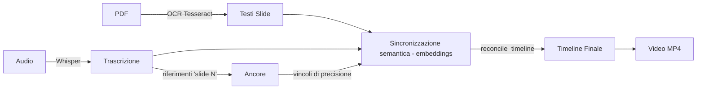

# Slide2Video 🎬

[](https://github.com/riefolog-cyber/sync-video/actions/workflows/ci.yml)

Sincronizza automaticamente una presentazione PDF con un podcast audio e genera un video in cui ogni slide appare al momento giusto.

**Pipeline:** PDF → OCR → Trascrizione (Whisper) → Ancore "slide N" → Sincronizzazione semantica (embeddings) → Video MP4


```mermaid
graph LR
    A[PDF] -->|OCR Tesseract| B[Testi Slide]
    C[Audio] -->|Whisper| D[Trascrizione]
    D -->|riferimenti 'slide N'| E[Ancore]
    B --> F[Sincronizzazione semantica - embeddings]
    D --> F
    E -->|vincoli di precisione| F
    F -->|reconcile_timeline| G[Timeline Finale]
    G --> H[Video MP4]
```

---

## 🚀 Avvio rapido

```bash
# Opzione 1: Doppio click su genera_video.bat

# Opzione 2: Terminale
genera_video.bat

# Il bootstrap installa automaticamente TUTTE le dipendenze:
# pacchetti pip, Tesseract OCR, ffmpeg, modelli ML
# Su Windows installa anche Python, se sul PC non c'e' ne' uno
# (via winget: serve Windows 10 1809 o Windows 11).
# Output: video_finale.mp4
#
# Installa/aggiorna anche i pacchetti sotto la versione minima richiesta: un
# pacchetto troppo vecchio puo' far fallire l'import di un ALTRO pacchetto (es.
# numpy vecchio -> pandas non si importa -> pytesseract sembra guasto).
```

> Su Windows non devi installare niente a mano: scarichi lo ZIP, fai doppio
> clic su `genera_video.bat`, e il programma prepara il PC da sé. Su Linux e
> macOS Python va installato a mano. Dettagli e come disattivare
> l'installazione automatica: [docs/setup.md](docs/setup.md#primo-avvio-automatico).

### 🔒 Ambiente dedicato (consigliato)

Il programma funziona anche col Python di sistema, ma quel Python è **condiviso con tutti gli altri programmi del PC**: un `pip install` fatto altrove può cambiare una versione e impedire l'avvio. Misurato il 16/09/2026: un'altra installazione ha messo `numpy 1.24.3` e `pandas` (dipendenza di pytesseract) non si importava più, quindi la pipeline non partiva nemmeno per le fasi che non usano l'OCR.

```bash
# Una volta sola: crea la cartella .venv e installa i pacchetti del progetto
crea_venv.bat          # Windows
./crea_venv.sh         # macOS e Linux (stesso scopo, script shell)
```

> I due script sono gemelli: `crea_venv.bat` per Windows, `crea_venv.sh` per
> macOS/Linux. Usa quello del tuo sistema — i `.bat` non esistono su macOS/Linux
> e i `.sh` su Windows.

Da quel momento `genera_video.bat`, `aggiornamenti.bat`, `prova.bat` e `check_embedding_models.bat` usano `.venv` da soli: non serve cambiare nulla a mano. Su macOS/Linux il comando è `.venv/bin/python main.py`.

| Comando | Cosa fa |
|---|---|
| `crea_venv.bat` / `./crea_venv.sh` | Crea `.venv` (o completa i pacchetti mancanti se esiste) |
| `crea_venv.bat --ricrea` / `./crea_venv.sh --ricrea` | Cancella `.venv` e la ricrea da zero |
| `set SYNC_VIDEO_NO_VENV=1` | Usa il Python di sistema, ignorando `.venv` (Windows) |

La venv **riusa i modelli già scaricati** (cartella `.cache` e cache di HuggingFace): non riscarica nulla, e la prima run resta veloce. Dentro `.venv` `pip check` non segnala conflitti; nel Python globale ne convivono diversi (pacchetti di altri progetti).

> **Cambio di PC / hardware**: il motore di trascrizione **non viene mai
> ripreso da disco**. In `.cache/machine_setup.json` si salvano solo i *fatti*
> hardware (impronta della macchina + lista delle GPU), che sono lenti da
> ottenere ma stabili; la *decisione* ("usa CUDA", "usa OpenVINO") è ricalcolata
> a ogni run e poi **validata contro il runtime reale** (il device esiste? il
> pacchetto è installato? il modello c'è?). Se non regge, ripiega su CPU
> avvisando. Perché: la decisione dipende da fatti che cambiano (che pacchetti
> sono installati, che device espone il runtime *adesso*), mentre l'hardware no.
> Persistendola, copiare la cartella da un PC con GPU NVIDIA a uno senza chiudeva
> la run con `CUDA driver version is insufficient` **dopo** OCR e rendering, senza
> che nulla avesse notato che la GPU non c'era più.
>
> Come difesa aggiuntiva, se faster-whisper non riesce a costruire il modello su
> CUDA, ripiega da solo su CPU (int8) e la pipeline prosegue; se però avevi
> chiesto `--whisper-device cuda` esplicitamente, non lo fa di nascosto e ti
> avvisa. `.env` resta per gli override espliciti tuoi (che hanno precedenza);
> se cambi GPU restando sullo stesso sistema, `--force-setup` rileva di nuovo.

> **Precisione assoluta**: il programma non distribuisce mai le slide uniformemente. La timeline viene costruita dal **solo** allineamento semantico (embeddings offline, senza LLM), vincolato dai riferimenti espliciti "slide N" nella trascrizione. Se non è generabile → **interruzione con avviso**.

### 🔀 Flussi supportati

| Flusso | Segnale nell'audio | Esempio |
|---|---|---|
| `slide-audio` | *"Passiamo alla slide 3"* | Speaker nominano il numero slide: in cifre (*"slide 3"*), in cardinali (*"slide tre"*) o in ordinali (*"la terza diapositiva"*, *"la sesta slide"*) |
| `audio-slide` | *"Passiamo al blocco successivo"* | Dibattito, poi slide generate dopo |
| `free` | nessuno (riordino libero) | Dibattito che salta tra i temi senza nominare le slide: il sistema mostra di volta in volta la slide semanticamente più vicina, in qualsiasi ordine e anche ripetuta |

Override manuale: `python main.py --flow audio-slide` oppure `python main.py --flow free`

> **Auto-detection automatica**: il sistema sceglie da solo. Se il podcast segue
> i vincoli del prompt NotebookLM (`slide N` o `blocco successivo`) usa il flusso
> ordinato corrispondente e rispetta le ancore; se NON segue il prompt (nessun
> segnale), usa automaticamente il riordino libero `free`.
>
> **Flusso `free`**: ideale quando il podcast non segue l'ordine delle slide
> (es. dibattiti). Per ogni blocco audio mostra la slide più vicina per contenuto,
> in qualsiasi ordine e anche ripetuta, con anti-flicker (durata minima dei
> segmenti, ~8s) e avviso sulle slide mai menzionate.

### 📝 Prompt NotebookLM (come generare presentazione e podcast)

Due ricette pronte, in base al punto di partenza:

| Prompt | Flusso | Quando usarlo |
|---|---|---|
| [`PROMPT_PRESENTAZIONE (PREDEFINITO).md`](<PROMPT_PRESENTAZIONE (PREDEFINITO).md>) | **A**: deck → podcast con ancore `slide N` | **Consigliato.** Confini **misurati** (è lo speaker a dichiarare il tempo). Podcast più strutturato. Fragile a un errore operativo: se il deck cambia dopo il podcast, le ancore puntano a pagine che non esistono più |
| [`PROMPT_PODCAST.md`](<PROMPT_PODCAST.md>) | **B**: podcast libero → deck derivato dal parlato | Più robusto: non c'è nulla da tenere allineato, e un errore si corregge rigenerando **solo il deck** (l'audio si riusa). Confini **stimati** dal contenuto: possono cadere minuti fuori posto, e va verificato nel riepilogo |

**Come scegliere.** I due flussi non sono "uno giusto e uno di riserva": hanno
vantaggi diversi e difetti diversi.

- **Scegli A** se ti serve la massima precisione e sei disposto a mantenere
  deck e podcast allineati. L'unico difetto è che un errore operativo
  (rigenerare il deck dopo il podcast) si paga carissimo: nuova trascrizione.
- **Scegli B** se preferisci la robustezza. Il deck nasce dal podcast, quindi
  ordine e contenuto coincidono per costruzione: non c'è una scommessa da
  fare. Il prezzo è che le durate sono stimate, non dichiarate.
- **Passa da B ad A** se compare `weak_signal: true`: significa che il solo
  contenuto non distingue bene le sezioni (picco normalizzato sotto soglia, o
  picchi fuori ordine), quindi le durate sono stime. Nel flusso A i confini
  sono le frasi pronunciate e non soffrono di questo.

Entrambi richiedono che ogni pagina abbia una sezione di parlato **sviluppata**:
una sezione che si limita a elencare produce una pagina che nel video scorre
veloce (vedi `starved_slides` nel report).

**I due prompt.** Sono due, e non ce n'è un terzo: ciascuno contiene tutto
quello che serve perché il video sia sincronizzato, più il tono del dibattito
e l'istruzione grafica (un elemento visivo per pagina, senza testo
decorativo: l'OCR legge tutto ciò che appare e il testo fuori corpo diluisce
il segnale). Ogni regola è blindata da `test_prompts.py`: se una frase
protettiva sparisce dai file, i test falliscono.

| Prompt | Flusso | Perché questo e non l'altro |
|---|---|---|
| [`PROMPT_PRESENTAZIONE (PREDEFINITO).md`](<PROMPT_PRESENTAZIONE (PREDEFINITO).md>) | A: presentazione → podcast | I confini sono **misurati**: il conduttore dichiara il numero della pagina. Costa un ciclo in più e un podcast più dichiarato, in cambio di confini esatti |
| [`PROMPT_PODCAST.md`](<PROMPT_PODCAST.md>) | B: podcast → presentazione | Il deck nasce dal parlato e un errore si corregge rigenerando **solo il deck**. In compenso i confini sono **stimati** e possono cadere minuti fuori posto |


### ✅ Ricetta validata (flusso A, 5 run verdi consecutive)

Procedura congelata: deck da 12–15 slide generato dal prompt, **presentazione come UNICA fonte** per il podcast, annunci `slide N` su tutte le transizioni, sezioni da 45s in su. Gate `--min-anchor-coverage` (default 50%) attivo in `genera_video.bat`.

| Run | Slide | Ancore | Durata min | Fiducia motore | Frame-check | Dubbi manuali |
|---|---|---|---|---|---|---|
| 1 | 12 | 11/11 | 45s | 0.74 alta | 12/12 | 2 (non allarmi) |
| 2 | 15 | 13/14 | 58s | 0.62 alta | 15/15 | 2 (non allarmi) |
| 3 | 14 | 12/13 | 37s | 0.53 alta | 14/14 | 2 (non allarmi) |
| 4 | 15 | 13/14 | 58s | 0.79 alta | 15/15 | **nessuno** |
| 5 | 15 | 11/14 | 45s | 0.65 alta | 15/15 | **nessuno** |

Se i materiali seguono le regole (fonte unica, tutte le pagine annunciate, sezioni sviluppate), il risultato si ripete: non modificare prompt né soglie senza rieseguire `python -m unittest test_prompts test_sync`.


### 🤖 Selezione con LLM (opzionale, supera il tetto dell'embedding)

L'embedding locale (e5-large) ha un tetto di precisione quando le slide sono
semanticamente simili tra loro (stesso tema). Un LLM che legge slide +
trascrizione INSIEME comprende il significato e può associare meglio la slide
ai momenti del podcast (es. "covert" → slide Overt/Covert).

- Unico provider: **9Router** online (localhost:20128). Modello principale:
  la **combo `comboact`** (dozzine di modelli liberi mantenuti dallo script
  `9router-maintenance/update-comboact.ps1`: Gemini, Kimi, DeepSeek, Nemotron,
  GLM, Qwen, ecc.; lo script misura la latenza di ognuno e mette i più veloci
  in testa). Inviando `"model": "comboact"` il router instrada il primo
  modello funzionante, con backup espliciti Cloudflare Mistral 24B → Gemma
  4 31B it (free) → fallback **embedding locale**. Nessuna interruzione. Modelli e URL
  sovrascrivibili con `LLM_9ROUTER_MODEL`, `LLM_9ROUTER_BACKUP_MODEL`,
  `LLM_9ROUTER_BACKUP_MODEL_2`, `LLM_9ROUTER_URL`, `LLM_9ROUTER_API_KEY`.
- Tre usi, in base al flusso:
  1. **Flusso libero** (`free`): sceglie la slide per ogni chunk audio.
  2. **Flusso ibrido ordinato** (`slide-audio`/`audio-slide`): posiziona SOLO
     le slide **senza ancora esplicita** "slide N", rispettando alla lettera
     le ancore deterministiche. Risolve il caso in cui l'embedding inventa
     durate per slide mai nominate o narrate fuori posizione.
  3. **Verifica del mapping ancore**: se la numerazione parlata non è allineata
     al PDF (es. lo speaker dice "slide 1" mostrando la slide 2, o "quarta
     diapositiva" mostrando la 5), corregge il numero di slide di ogni ancora
     mantenendone i TEMPI esatti. Prima interviene un'**euristica deterministica
     offline** (embeddings locali, sempre attiva, anche con `--llm off`): rileva
     un offset sistematico coerente su tutte le ancore e lo applica senza
     chiamare 9Router. Solo se l'offset non è sistematico si passa al **fallback
     LLM**, che legge il contenuto del parlato dopo ogni "slide N" per decidere
     il numero reale di slide.
- Configurabile: `--llm auto|off|9router`, `--llm-model`, `--llm-chunk`.
- La risposta LLM viene cachata (hash slide+audio+chunk+modelli+ancore): non
  si ripaga a ogni run, e cambiando `--llm-model` la cache viene rigenerata
  (niente risultati di un altro modello). Nota: il supporto a **LM Studio**
  (modelli locali come `qwen2.5-7b-instruct` o `gemma-4-12b-it`) è stato
  rimosso: inadatti al flusso libero sulla macchina di sviluppo.

```bash
# Attiva la selezione LLM (default: auto)
python main.py --llm auto --preview     # valuta senza generare video
python main.py --llm 9router           # forza 9Router online
```

> **Consiglio**: nominare la slide quando si cambia argomento (*"passiamo alla slide 3"*) regala ancore deterministiche ad alta precisione. Senza di esse il semantico allinea comunque per contenuto, ma per stima. Prompt NotebookLM: [`PROMPT_PRESENTAZIONE (PREDEFINITO).md`](<PROMPT_PRESENTAZIONE (PREDEFINITO).md>) — vedi "Come scegliere".
>
> ⚠️ **Il nemico non è dimenticare la slide: è richiamarla.** Se il conduttore
> torna su una pagina già trattata e ne ripete il numero (*"guarda sempre slide 3,
> applicano mercato"*), la pagina viene mostrata in ritardo e resta "appiccicata"
> alla precedente per tutto quel tempo. Misurato su un podcast reale: 3 confini su 8
> spostati di **74s, 85s e 53s**.
>
> Oggi è risolto su due livelli. **Alla fonte**, il prompt dedicato vieta i
> richiami e chiede di non ripetere mai un numero: è la soluzione vera, perché
> previene il difetto invece di correggerlo. **In difesa**, l'estrattore qualifica
> ogni menzione: distingue un conteggio quantificato (*"le 13 slide di questo
> documento"*, che va ignorato) da un riferimento vero, e fra i riferimenti sceglie
> la **prima** occorrenza, non l'ultima. Le due cose servono perché il semplice
> "prima menzione" rotolava indietro il video di oltre un minuto nel caso del
> conteggio, e su quel caso c'è un test dedicato
> (`test_early_total_slide_count_does_not_poison_real_anchor`).
>
> Se vedi `Slide richiamate più volte (richiamo ignorato...)` è un'informazione,
> non un allarme: segnala che il podcast richiama delle pagine e che il programma
> ha scelto il confine giusto ignorando il richiamo.

#### Manutenzione 9Router (`9router-maintenance/`)

La cartella `9router-maintenance/` contiene uno script PowerShell
(`update-comboact.ps1`) che mantiene la **combo `comboact`** esposta da 9Router:
testa in parallelo i modelli, rimuove quelli guasti/morti, aggiunge modelli
free e riordina per latenza (i più veloci in testa). Serve a mantenere pulito
e veloce il router lato server.

> **La combo `comboact` è il modello principale della pipeline**: `llm_sync.py`
> invia `"model": "comboact"` a `/v1/chat/completions`, così il router instrada
> automaticamente il primo modello funzionante della combo mantenuta dallo
> script. **Esegui `mantenimento-comboact.bat` periodicamente** (es. una volta
> a settimana, o quando il router segnala modelli guasti) per tenere la combo
> sana: la pipeline consuma direttamente il suo contenuto.
>
> Backup espliciti della stessa combo (se la combo risponde con errori):
> Cloudflare Mistral 24B → Gemma 4 31B it (free). Sovrascrivibili con
> `LLM_9ROUTER_BACKUP_MODEL` / `LLM_9ROUTER_BACKUP_MODEL_2`. Per usare un
> modello singolo invece della combo: `LLM_9ROUTER_MODEL=<modello>` o
> `--llm-model <modello>`.


---

## 📚 Documentazione

Questo README copre avvio rapido e uso quotidiano. Il resto e' in [`docs/`](docs/):

| Pagina | Contenuto |
|---|---|
| [`docs/setup.md`](docs/setup.md) | Setup su un altro PC |
| [`docs/flussi.md`](docs/flussi.md) | Due flussi di lavoro (e i loro avvisi) |
| [`docs/comandi.md`](docs/comandi.md) | Comandi |
| [`docs/verifica.md`](docs/verifica.md) | Verifica post-run (analysis_sync.py) |
| [`docs/diagrammi.md`](docs/diagrammi.md) | Diagrammi (archify) |
| [`docs/9router.md`](docs/9router.md) | Gestione on-demand di 9Router |
| [`docs/struttura.md`](docs/struttura.md) | Struttura progetto |
| [`docs/funzionamento.md`](docs/funzionamento.md) | Come funziona |
| [`docs/troubleshooting.md`](docs/troubleshooting.md) | Troubleshooting |

| [`docs/sync-video-architecture.html`](docs/sync-video-architecture.html) | Diagramma architettura |

---

