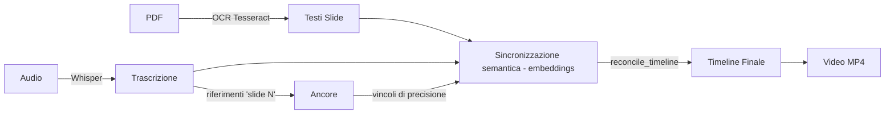

# Slide2Video 🎬

[](https://github.com/riefolog-cyber/sync-video/actions/workflows/ci.yml)

Sincronizza automaticamente una presentazione PDF con un podcast audio e genera un video in cui ogni slide appare al momento giusto.

**Pipeline:** PDF → OCR → Trascrizione (Whisper) → Ancore "slide N" → Sincronizzazione semantica (embeddings) → Video MP4


```mermaid
graph LR
    A[PDF] -->|OCR Tesseract| B[Testi Slide]
    C[Audio] -->|Whisper| D[Trascrizione]
    D -->|riferimenti 'slide N'| E[Ancore]
    B --> F[Sincronizzazione semantica - embeddings]
    D --> F
    E -->|vincoli di precisione| F
    F -->|reconcile_timeline| G[Timeline Finale]
    G --> H[Video MP4]
```

---

## 🚀 Avvio rapido

```bash
# Opzione 1: Doppio click su genera_video.bat

# Opzione 2: Terminale
python main.py

# Il bootstrap installa automaticamente TUTTE le dipendenze:
# pacchetti pip, Tesseract OCR, ffmpeg, modelli ML
# Output: video_finale.mp4
#
# Installa/aggiorna anche i pacchetti sotto la versione minima richiesta: un
# pacchetto troppo vecchio può far fallire l'import di un ALTRO pacchetto (es.
# numpy vecchio -> pandas non si importa -> pytesseract sembra guasto).
```

### 🔒 Ambiente dedicato (consigliato)

Il programma funziona anche col Python di sistema, ma quel Python è **condiviso con tutti gli altri programmi del PC**: un `pip install` fatto altrove può cambiare una versione e impedire l'avvio. Misurato il 16/09/2026: un'altra installazione ha messo `numpy 1.24.3` e `pandas` (dipendenza di pytesseract) non si importava più, quindi la pipeline non partiva nemmeno per le fasi che non usano l'OCR.

```bash
# Una volta sola: crea la cartella .venv e installa i pacchetti del progetto
crea_venv.bat          # Windows
./crea_venv.sh         # macOS e Linux (stesso scopo, script shell)
```

> I due script sono gemelli: `crea_venv.bat` per Windows, `crea_venv.sh` per
> macOS/Linux. Usa quello del tuo sistema — i `.bat` non esistono su macOS/Linux
> e i `.sh` su Windows.

Da quel momento `genera_video.bat`, `aggiornamenti.bat`, `prova.bat` e `check_embedding_models.bat` usano `.venv` da soli: non serve cambiare nulla a mano. Su macOS/Linux il comando è `.venv/bin/python main.py`.

| Comando | Cosa fa |
|---|---|
| `crea_venv.bat` / `./crea_venv.sh` | Crea `.venv` (o completa i pacchetti mancanti se esiste) |
| `crea_venv.bat --ricrea` / `./crea_venv.sh --ricrea` | Cancella `.venv` e la ricrea da zero |
| `set SYNC_VIDEO_NO_VENV=1` | Usa il Python di sistema, ignorando `.venv` (Windows) |

La venv **riusa i modelli già scaricati** (cartella `.cache` e cache di HuggingFace): non riscarica nulla, e la prima run resta veloce. Dentro `.venv` `pip check` non segnala conflitti; nel Python globale ne convivono diversi (pacchetti di altri progetti).

> **Cambio di PC / hardware**: il motore di trascrizione **non viene mai
> ripreso da disco**. In `.cache/machine_setup.json` si salvano solo i *fatti*
> hardware (impronta della macchina + lista delle GPU), che sono lenti da
> ottenere ma stabili; la *decisione* ("usa CUDA", "usa OpenVINO") è ricalcolata
> a ogni run e poi **validata contro il runtime reale** (il device esiste? il
> pacchetto è installato? il modello c'è?). Se non regge, ripiega su CPU
> avvisando. Perché: la decisione dipende da fatti che cambiano (che pacchetti
> sono installati, che device espone il runtime *adesso*), mentre l'hardware no.
> Persistendola, copiare la cartella da un PC con GPU NVIDIA a uno senza chiudeva
> la run con `CUDA driver version is insufficient` **dopo** OCR e rendering, senza
> che nulla avesse notato che la GPU non c'era più.
>
> Come difesa aggiuntiva, se faster-whisper non riesce a costruire il modello su
> CUDA, ripiega da solo su CPU (int8) e la pipeline prosegue; se però avevi
> chiesto `--whisper-device cuda` esplicitamente, non lo fa di nascosto e ti
> avvisa. `.env` resta per gli override espliciti tuoi (che hanno precedenza);
> se cambi GPU restando sullo stesso sistema, `--force-setup` rileva di nuovo.

> **Precisione assoluta**: il programma non distribuisce mai le slide uniformemente. La timeline viene costruita dal **solo** allineamento semantico (embeddings offline, senza LLM), vincolato dai riferimenti espliciti "slide N" nella trascrizione. Se non è generabile → **interruzione con avviso**.

### 🔀 Flussi supportati

| Flusso | Segnale nell'audio | Esempio |
|---|---|---|
| `slide-audio` | *"Passiamo alla slide 3"* | Speaker nominano il numero slide: in cifre (*"slide 3"*), in cardinali (*"slide tre"*) o in ordinali (*"la terza diapositiva"*, *"la sesta slide"*) |
| `audio-slide` | *"Passiamo al blocco successivo"* | Dibattito, poi slide generate dopo |
| `free` | nessuno (riordino libero) | Dibattito che salta tra i temi senza nominare le slide: il sistema mostra di volta in volta la slide semanticamente più vicina, in qualsiasi ordine e anche ripetuta |

Override manuale: `python main.py --flow audio-slide` oppure `python main.py --flow free`

> **Auto-detection automatica**: il sistema sceglie da solo. Se il podcast segue
> i vincoli del prompt NotebookLM (`slide N` o `blocco successivo`) usa il flusso
> ordinato corrispondente e rispetta le ancore; se NON segue il prompt (nessun
> segnale), usa automaticamente il riordino libero `free`.
>
> **Flusso `free`**: ideale quando il podcast non segue l'ordine delle slide
> (es. dibattiti). Per ogni blocco audio mostra la slide più vicina per contenuto,
> in qualsiasi ordine e anche ripetuta, con anti-flicker (durata minima dei
> segmenti, ~8s) e avviso sulle slide mai menzionate.

### 📝 Prompt NotebookLM (come generare presentazione e podcast)

Due ricette pronte, in base al punto di partenza:

| Prompt | Flusso | Quando usarlo |
|---|---|---|
| [`PROMPT_PRESENTAZIONE (PREDEFINITO).md`](<PROMPT_PRESENTAZIONE (PREDEFINITO).md>) | **A**: deck → podcast con ancore `slide N` | **Consigliato.** Confini **misurati** (è lo speaker a dichiarare il tempo). Podcast più strutturato. Fragile a un errore operativo: se il deck cambia dopo il podcast, le ancore puntano a pagine che non esistono più |
| [`PROMPT_PODCAST.md`](<PROMPT_PODCAST.md>) | **B**: podcast libero → deck derivato dal parlato | Più robusto: non c'è nulla da tenere allineato, e un errore si corregge rigenerando **solo il deck** (l'audio si riusa). Confini **stimati** dal contenuto: possono cadere minuti fuori posto, e va verificato nel riepilogo |

**Come scegliere.** I due flussi non sono "uno giusto e uno di riserva": hanno
vantaggi diversi e difetti diversi.

- **Scegli A** se ti serve la massima precisione e sei disposto a mantenere
  deck e podcast allineati. L'unico difetto è che un errore operativo
  (rigenerare il deck dopo il podcast) si paga carissimo: nuova trascrizione.
- **Scegli B** se preferisci la robustezza. Il deck nasce dal podcast, quindi
  ordine e contenuto coincidono per costruzione: non c'è una scommessa da
  fare. Il prezzo è che le durate sono stimate, non dichiarate.
- **Passa da B ad A** se compare `weak_signal: true`: significa che il solo
  contenuto non distingue bene le sezioni (picco normalizzato sotto soglia, o
  picchi fuori ordine), quindi le durate sono stime. Nel flusso A i confini
  sono le frasi pronunciate e non soffrono di questo.

Entrambi richiedono che ogni pagina abbia una sezione di parlato **sviluppata**:
una sezione che si limita a elencare produce una pagina che nel video scorre
veloce (vedi `starved_slides` nel report).

**I due prompt.** Sono due, e non ce n'è un terzo: ciascuno contiene tutto
quello che serve perché il video sia sincronizzato, più il tono del dibattito
e l'istruzione grafica (un elemento visivo per pagina, senza testo
decorativo: l'OCR legge tutto ciò che appare e il testo fuori corpo diluisce
il segnale). Ogni regola è blindata da `test_prompts.py`: se una frase
protettiva sparisce dai file, i test falliscono.

| Prompt | Flusso | Perché questo e non l'altro |
|---|---|---|
| [`PROMPT_PRESENTAZIONE (PREDEFINITO).md`](<PROMPT_PRESENTAZIONE (PREDEFINITO).md>) | A: presentazione → podcast | I confini sono **misurati**: il conduttore dichiara il numero della pagina. Costa un ciclo in più e un podcast più dichiarato, in cambio di confini esatti |
| [`PROMPT_PODCAST.md`](<PROMPT_PODCAST.md>) | B: podcast → presentazione | Il deck nasce dal parlato e un errore si corregge rigenerando **solo il deck**. In compenso i confini sono **stimati** e possono cadere minuti fuori posto |


### ✅ Ricetta validata (flusso A, 5 run verdi consecutive)

Procedura congelata: deck da 12–15 slide generato dal prompt, **presentazione come UNICA fonte** per il podcast, annunci `slide N` su tutte le transizioni, sezioni da 45s in su. Gate `--min-anchor-coverage` (default 50%) attivo in `genera_video.bat`.

| Run | Slide | Ancore | Durata min | Fiducia motore | Frame-check | Dubbi manuali |
|---|---|---|---|---|---|---|
| 1 | 12 | 11/11 | 45s | 0.74 alta | 12/12 | 2 (non allarmi) |
| 2 | 15 | 13/14 | 58s | 0.62 alta | 15/15 | 2 (non allarmi) |
| 3 | 14 | 12/13 | 37s | 0.53 alta | 14/14 | 2 (non allarmi) |
| 4 | 15 | 13/14 | 58s | 0.79 alta | 15/15 | **nessuno** |
| 5 | 15 | 11/14 | 45s | 0.65 alta | 15/15 | **nessuno** |

Se i materiali seguono le regole (fonte unica, tutte le pagine annunciate, sezioni sviluppate), il risultato si ripete: non modificare prompt né soglie senza rieseguire `python -m unittest test_prompts test_sync`.


### 🤖 Selezione con LLM (opzionale, supera il tetto dell'embedding)

L'embedding locale (e5-large) ha un tetto di precisione quando le slide sono
semanticamente simili tra loro (stesso tema). Un LLM che legge slide +
trascrizione INSIEME comprende il significato e può associare meglio la slide
ai momenti del podcast (es. "covert" → slide Overt/Covert).

- Unico provider: **9Router** online (localhost:20128). Modello principale:
  la **combo `comboact`** (dozzine di modelli liberi mantenuti dallo script
  `9router-maintenance/update-comboact.ps1`: Gemini, Kimi, DeepSeek, Nemotron,
  GLM, Qwen, ecc.; lo script misura la latenza di ognuno e mette i più veloci
  in testa). Inviando `"model": "comboact"` il router instrada il primo
  modello funzionante, con backup espliciti Cloudflare Mistral 24B → Gemma
  4 31B it (free) → fallback **embedding locale**. Nessuna interruzione. Modelli e URL
  sovrascrivibili con `LLM_9ROUTER_MODEL`, `LLM_9ROUTER_BACKUP_MODEL`,
  `LLM_9ROUTER_BACKUP_MODEL_2`, `LLM_9ROUTER_URL`, `LLM_9ROUTER_API_KEY`.
- Tre usi, in base al flusso:
  1. **Flusso libero** (`free`): sceglie la slide per ogni chunk audio.
  2. **Flusso ibrido ordinato** (`slide-audio`/`audio-slide`): posiziona SOLO
     le slide **senza ancora esplicita** "slide N", rispettando alla lettera
     le ancore deterministiche. Risolve il caso in cui l'embedding inventa
     durate per slide mai nominate o narrate fuori posizione.
  3. **Verifica del mapping ancore**: se la numerazione parlata non è allineata
     al PDF (es. lo speaker dice "slide 1" mostrando la slide 2, o "quarta
     diapositiva" mostrando la 5), corregge il numero di slide di ogni ancora
     mantenendone i TEMPI esatti. Prima interviene un'**euristica deterministica
     offline** (embeddings locali, sempre attiva, anche con `--llm off`): rileva
     un offset sistematico coerente su tutte le ancore e lo applica senza
     chiamare 9Router. Solo se l'offset non è sistematico si passa al **fallback
     LLM**, che legge il contenuto del parlato dopo ogni "slide N" per decidere
     il numero reale di slide.
- Configurabile: `--llm auto|off|9router`, `--llm-model`, `--llm-chunk`.
- La risposta LLM viene cachata (hash slide+audio+chunk+modelli+ancore): non
  si ripaga a ogni run, e cambiando `--llm-model` la cache viene rigenerata
  (niente risultati di un altro modello). Nota: il supporto a **LM Studio**
  (modelli locali come `qwen2.5-7b-instruct` o `gemma-4-12b-it`) è stato
  rimosso: inadatti al flusso libero sulla macchina di sviluppo.

```bash
# Attiva la selezione LLM (default: auto)
python main.py --llm auto --preview     # valuta senza generare video
python main.py --llm 9router           # forza 9Router online
```

> **Consiglio**: nominare la slide quando si cambia argomento (*"passiamo alla slide 3"*) regala ancore deterministiche ad alta precisione. Senza di esse il semantico allinea comunque per contenuto, ma per stima. Prompt NotebookLM: [`PROMPT_PRESENTAZIONE (PREDEFINITO).md`](<PROMPT_PRESENTAZIONE (PREDEFINITO).md>) — vedi "Come scegliere".
>
> ⚠️ **Il nemico non è dimenticare la slide: è richiamarla.** Se il conduttore
> torna su una pagina già trattata e ne ripete il numero (*"guarda sempre slide 3,
> applicano mercato"*), la pagina viene mostrata in ritardo e resta "appiccicata"
> alla precedente per tutto quel tempo. Misurato su un podcast reale: 3 confini su 8
> spostati di **74s, 85s e 53s**.
>
> Oggi è risolto su due livelli. **Alla fonte**, il prompt dedicato vieta i
> richiami e chiede di non ripetere mai un numero: è la soluzione vera, perché
> previene il difetto invece di correggerlo. **In difesa**, l'estrattore qualifica
> ogni menzione: distingue un conteggio quantificato (*"le 13 slide di questo
> documento"*, che va ignorato) da un riferimento vero, e fra i riferimenti sceglie
> la **prima** occorrenza, non l'ultima. Le due cose servono perché il semplice
> "prima menzione" rotolava indietro il video di oltre un minuto nel caso del
> conteggio, e su quel caso c'è un test dedicato
> (`test_early_total_slide_count_does_not_poison_real_anchor`).
>
> Se vedi `Slide richiamate più volte (richiamo ignorato...)` è un'informazione,
> non un allarme: segnala che il podcast richiama delle pagine e che il programma
> ha scelto il confine giusto ignorando il richiamo.

#### Manutenzione 9Router (`9router-maintenance/`)

La cartella `9router-maintenance/` contiene uno script PowerShell
(`update-comboact.ps1`) che mantiene la **combo `comboact`** esposta da 9Router:
testa in parallelo i modelli, rimuove quelli guasti/morti, aggiunge modelli
free e riordina per latenza (i più veloci in testa). Serve a mantenere pulito
e veloce il router lato server.

> **La combo `comboact` è il modello principale della pipeline**: `llm_sync.py`
> invia `"model": "comboact"` a `/v1/chat/completions`, così il router instrada
> automaticamente il primo modello funzionante della combo mantenuta dallo
> script. **Esegui `mantenimento-comboact.bat` periodicamente** (es. una volta
> a settimana, o quando il router segnala modelli guasti) per tenere la combo
> sana: la pipeline consuma direttamente il suo contenuto.
>
> Backup espliciti della stessa combo (se la combo risponde con errori):
> Cloudflare Mistral 24B → Gemma 4 31B it (free). Sovrascrivibili con
> `LLM_9ROUTER_BACKUP_MODEL` / `LLM_9ROUTER_BACKUP_MODEL_2`. Per usare un
> modello singolo invece della combo: `LLM_9ROUTER_MODEL=<modello>` o
> `--llm-model <modello>`.


---

## 🖥️ Setup su un altro PC

1. **Installa Python 3.10+** da [python.org](https://python.org) — spunta **"Add Python to PATH"**.
2. **Installa Git** da [git-scm.com](https://git-scm.com) (se non presente).
3. **Clona il repository**:
   ```bash
   git clone https://github.com/riefolog-cyber/sync-video.git
   cd sync-video
   ```
4. **Aggiungi i tuoi file**: `presentazione.pdf` e `podcast.m4a` nella stessa cartella.
5. **Lancia `genera_video.bat`** — tutto il resto è automatico. A fine run il
   programma controlla da solo il video prodotto (un fotogramma a metà di ogni
   slide), **corregge da sé** i confini che non tornano e rigenera il video, poi
   stampa un riepilogo in parole semplici: quante slide, quanto durano, cosa è
   stato corretto e cosa conviene controllare a mano.

### Cosa viene installato automaticamente al primo avvio

| Componente | Dimensione | Metodo |
|---|---|---|
| Pacchetti pip (13 su x86-64) | ~250 MB | `pip install` |
| Tesseract OCR | ~40 MB | `winget` / `apt-get` / `brew` |
| ffmpeg | ~80 MB | `winget` / `apt-get` / `brew` |
| Modello embedding e5-large | **~6.4 GB** di disco | fastembed (download automatico) |
| Modello Whisper `small` (CPU) | ~490 MB | faster-whisper (download automatico) |
| Modello Whisper OpenVINO | ~80 MB (`tiny`) / ~930 MB (`small`) | `--openvino-download` (facoltativo) |
| Lingua Tesseract ITA | inclusa | `tessdata/ita.traineddata` |

> **Perché 6.4 GB e non 2.2 per il modello embedding.** Il download è ~2.2 GB,
> ma fastembed tiene **due copie** di `multilingual-e5-large` nella cache
> (`.cache/embedding_model/`): `fast-multilingual-e5-large` (2.1 GB) e
> `models--qdrant--multilingual-e5-large-onnx` (4.3 GB), misurate. È un
> comportamento di fastembed, non una scelta del progetto, ma è quello che
> occupa disco: **chi pianifica lo spazio deve contare 6.4 GB**, non 2.2.
>
> **Il modello Whisper CPU è nella cache HuggingFace**, non in `.cache/`: con
> `HF_HOME` personalizzato va cercato lì. La copia OpenVINO è **facoltativa** e
> non viene scaricata dal percorso di default.
>
> Al primo avvio il programma **annuncia questi download prima di farli**,
> perché un download da qualche gigabyte in silenzio è indistinguibile da un
> blocco. Se i modelli sono già in cache non stampa nulla.

> **La trascrizione è il collo di bottiglia** (≈85% del tempo su un podcast
> reale). I due acceleratori sono attivi **di default** e non richiedono setup:
>
> 1. **Decoding a batch** (`--whisper-batch 8`): stesso modello, stessi pesi,
>    stessa decodifica, solo più segmenti elaborati insieme.
> 2. **Beam size 1** (`--whisper-beam 1`): decodifica greedy.
>
> Misurato su podcast reale (17m38s, Snapdragon X Elite, small int8, 8 thread):
>
> | configurazione | tempo |
> |---|---|
> | beam 5 sequenziale | 91.5 s (su 240 s di audio) |
> | beam 1 sequenziale | 74.6 s |
> | **beam 1 + batch 8 (default)** | **40.1 s** |
>
> Sull'audio intero: 2m59s invece di ~6m40s stimati, cioè **~2.3× più veloce**.
> **Precisione:** confrontando le 10 ancore `slide N` con quelle prodotte da
> beam 5, lo scarto medio è 0.050s e il massimo **0.150s** — 20 volte sotto la
> durata minima di una slide (3s), nessuna ancora persa o aggiunta. Le ancore
> sono ciò che vincola la timeline, quindi la sincronizzazione non cambia.
> Se serve il testo più accurato possibile: `--whisper-beam 5` (il batch resta
> attivo, nessuna perdita); per disattivare il batch: `--whisper-batch 0`.
>
> **La scelta del beam è automatica.** Il beam è un parametro della
> *trascrizione*, ma le ancore `slide N` si conoscono solo *dopo* aver
> trascritto: la decisione non può essere presa in anticipo. Quindi la pipeline
> trascrive veloce (greedy) e poi corregge:
>
> - **timeline vincolata dalle ancore** (≥ metà delle slide annunciate): il testo
>   rifinisce confini già decisi, quindi la decodifica veloce resta. Nessun costo.
> - **timeline decisa dal contenuto** (flusso libero, o meno della metà delle
>   slide annunciate): il testo è l'unico segnale di sincronizzazione, quindi la
>   trascrizione viene rifatta a beam `5`.
>
> Il costo della seconda trascrizione si paga **una volta sola per audio**: la
> cache è per chiave, quindi la run successiva ritrova entrambe le trascrizioni
> (verificato: seconda run 0s). Con un deck ancorato non succede nulla di tutto
> questo. Disattivabile con `--no-auto-beam` (o `AUTO_BEAM=0`); si può forzare il
> percorso accurato con `AUTO_BEAM_PINNED_RATIO=1.1`. Con `--whisper-beam 2` o
> superiore la scelta automatica non interviene: hai già scelto l'accuratezza.
>
> **La scelta viene misurata, e poi seguita.** Poiché le due trascrizioni
> esistono entrambe, la pipeline ne confronta la qualità di allineamento sulle
> stesse slide e **senza ancore** (è il caso in cui il testo decide) e usa
> quella col segnale migliore:
>
> - l'accurata vince (di almeno `AUTO_BEAM_AB_MARGIN`, default `0`) → resta l'accurata;
> - vince la **veloce** → si usa la veloce: i minuti della decodifica accurata
>   non si pagano più, né per il testo né per il resto della pipeline;
> - l'accurata ha trovato **ancore** che la veloce non aveva → resta l'accurata
>   (le ancore sono riferimenti espliciti, più affidabili di un proxy di somiglianza);
> - confronto non calcolabile → resta l'accurata (scelta prudente).
>
> La misura costa ~25s per trascrizione (~50-70s in tutto su un podcast da 17
> minuti, solo nel percorso accurato), quindi viene **messa in cache** e riusata:
> rifarla a ogni run significherebbe due embedding completi per una decisione che
> non cambia. Sui dati reali del 13/09 vinceva la veloce (0.791 contro 0.770) e la
> pipeline usa la veloce: seconda run **40s in tutto**, senza re-embedding.
>
> **Quanto vale questa misura?** Verificata confrontando ~18 timeline candidate
> (corretta, spostata di 4s, invertita, mescolata, casuale) con la verità nota, su
> un deck derivato dall'audio e sul deck reale (probe temporaneo, non nel repo):
>
> - **differenze grandi → separazione netta.** Ordine invertito: 0.05 contro 0.68
>   della timeline corretta (accuratezza 0.00 contro 0.97). Il punteggio riconosce
>   senza ambiguità "slide sbagliata" e "ordine sbagliato".
> - **differenze piccole → non le distingue.** Spostando un confine di 8-20s il
>   punteggio può **salire** (0.530) mentre l'accuratezza **scende** (0.97 → 0.84):
>   il picco di somiglianza sta oltre il confine reale, perché lo speaker anticipa
>   l'argomento prima della transizione. Concordanza con la verità: 79.7%
>   (Spearman +0.743).
> - **la cosine grezza (vecchia misura) resta inutilizzabile:** varia tra 0.821 e
>   0.859 su *tutte* le candidate, giuste o sbagliate.
>
> Conseguenza pratica: uno scarto di ~0.02 fra due trascrizioni è **dentro la
> banda di rumore** del punteggio. La scelta fra le due resta legittima ma non è
> una "vittoria" dimostrata; per non ribaltare su rumore usare
> `AUTO_BEAM_AB_MARGIN=0.05`. Da sapere anche: il controllo frame **non può**
> rispondere a questa domanda — verifica che il video rispetti la timeline
> dichiarata (11/11 anche su una timeline arbitraria), non che la timeline sia
> quella giusta.
>
> Nota hardware: 12 thread sono più lenti di 8 su Snapdragon X Elite (banda di
> memoria), quindi il default resta 8.
>
> **L'embedding viene riusato, non ricalcolato.** La matrice slide↔blocchi è
> content-addressed (`.cache/embedding_cache/`, hash dei testi + identità del
> modello): stessi testi e stesso modello → stessi vettori, quindi le run
> ripetute sullo stesso podcast non ripagano l'embedding (misurato: 26s → 3s,
> run da 1m50s a 1m26s, timeline e 11/11 frame identici). Vale anche *dentro*
> la run: le slide embeddate per la verifica ancore e per il confronto fra
> trascrizioni sono le stesse della sincronizzazione, e il raffinamento dei
> confini le riusa. I file sono `.npz` (invisibili alla pulizia delle cache
> orfane, che guarda i `.json`) con un tetto di 40 voci (~1 MB l'una). Senza
> identità del modello la cache **non** viene usata: meglio ricalcolare che
> rischiare i vettori di un modello diverso.
>
> **La tabella tempi ora dice il vero.** Prima la riga `└ Embedding` mostrava il
> *caricamento del modello* (pochi secondi) e i ~25-30s di embedding veri non
> comparivano da nessuna parte — per questo lo spreco non era mai emerso. Ora
> `└ Embedding` è il calcolo dei vettori e `└ Modello` il caricamento, separati.
>
> Anche il tempo dell'LLM ha una riga sua (`└ LLM`), per lo stesso motivo: senza,
> una cascata LLM da ~328s finiva dentro `Sincronizzaz.` senza attribuzione e il
> costo restava invisibile finché non si leggevano i log riga per riga. Il tempo
> è contato anche per le chiamate **fallite**, che sono proprio quelle da vedere.
>
> **Il motore locale gira SEMPRE per primo, l'LLM è un escalation.** Il motore
> embedding costa pochi secondi (embedding in cache) e produce già una timeline
> utilizzabile, quindi viene sempre provato per primo e l'LLM serve solo a
> migliorarla. Prima l'ordine era inverso: oltre `--llm-local-threshold` slide
> senza ancora si saltava dritto all'LLM e, se falliva, si ricalcolava da capo il
> motore locale — nel run del 25/09 (12 slide senza ancora) questo costava ~328s
> di cascata per arrivare esattamente al fallback locale che si aveva a portata di
> mano in 2s. Ora la timeline locale viene **riusata** se l'LLM non dà niente.
>
> **Tre guardie sul costo dell'LLM**, nate dallo stesso run:
>
> 1. **Timeout 45s, non 120s.** Tarato sui dati reali di `comboact-state.json`
>    (p50 3.2s, max 10.9s su 37 modelli): 120s erano ~35x il p50, quindi non
>    scattavano mai per davvero e, quando scattavano, costavano 180s col retry
>    per scoprire che il backup rispondeva in 14s. Alzalo con
>    `LLM_9ROUTER_TIMEOUT` per i modelli "reasoning".
> 2. **Gli endpoint morti restano morti nella run.** Un timeout esaurito marca
>    l'endpoint come irraggiungibile: il retry non ripaga più gli stessi
>    timeout e va dritto al primo backup ancora vivo.
> 3. **I fallimenti vengono ricordati (cache negativa, TTL 30 min).** Prima la
>    cache LLM ricordava solo i successi, quindi un rerun ripagava l'intera
>    cascata per arrivare allo stesso fallback. Ora il rerun entro la finestra va
>    diretto al motore locale. La chiave è un hash del contenuto, quindi un
>    input diverso viene comunque ritentato. TTL con `LLM_FAILURE_TTL_SECONDS`
>    (`0` = disattiva).
>
> **OpenVINO GenAI (solo iGPU Intel).** Su PC Intel con iGPU Iris Xe e senza
> GPU NVIDIA è un'alternativa più veloce di faster-whisper su CPU (~5 min per 28
> min di audio), con word timestamps identici. Non serve su macchine ARM/AMD,
> dove OpenVINO vede solo la CPU. Setup una tantum:
>
> ```bash
> pip install openvino openvino-genai
> python main.py --openvino-download   # scarica il modello OpenVINO IR
> python main.py                       # ora usa OpenVINO in automatico
> ```
>
> **Setup automatico al primo avvio.** Alla prima run `main.py` rileva
> l'hardware del PC (via `machine_setup.py`), sceglie il motore più adatto e
> installa/scarica tutto il necessario, senza intervento manuale:
>
> - GPU NVIDIA → faster-whisper su **CUDA** (float16)
> - iGPU Intel (Iris/UHD/Arc) → **OpenVINO GenAI** (installazione `openvino-genai`
>   + download modello IR inclusi automaticamente)
> - altrimenti → faster-whisper su CPU
>
> La scelta è ricalcolata a ogni run a partire dall'hardware rilevato e
> validata contro il runtime (vedi "Cambio di PC / hardware" qui sotto); i fatti
> hardware restano in `.cache/machine_setup.json` con l'impronta della macchina.
> Controlla con `--force-setup` (rileva di nuovo) o disabilita con
> `--no-auto-setup`.
>
> **Su un PC nuovo, scarica i modelli prima.** Al primo avvio i modelli (~3 GB:
> embedding e5-large 2.2 GB, pesi Whisper, modello OpenVINO IR 930 MB) vengono
> scaricati *dentro* la run reale, mescolati al lavoro: un timeout di rete tronca
> tutto a metà e il log non distingue "modello mancante" da "download fallito".
> Meglio tenerli separati:
>
> ```bash
> python main.py --prefetch-models   # scarica tutto e esce (~3 GB, una tantum)
> python main.py                     # ora la prima run non scarica nulla
> ```
>
> Ogni modello è indipendente: quello non installabile su quella CPU viene
> saltato con una nota, senza far fallire gli altri.
>
> Fallback automatico a faster-whisper se OpenVINO non è installato o il
> modello manca. Seleziona il motore con `--transcriber {auto,openvino,whisper}`
> e il device con `--openvino-device {GPU,CPU}`.
>
> L'avviso "faster-whisper su CPU è LENTO… usa OpenVINO" compare **solo** se
> su quel PC OpenVINO è realmente utilizzabile: iGPU Intel rilevata da
> `machine_setup.json`, oppure runtime installato che espone un device GPU.
> La sola CPU OpenVINO non conta (nessun guadagno di velocità): su macchine
> AMD/ARM (es. Snapdragon X) il suggerimento viene soppresso.
>
> **Controllo aggiornamenti.** All'avvio (`updates.py`) verifica via PyPI se i
> pacchetti usati hanno versioni più recenti (risultato cachato per default 6h
> in `.cache/updates_check.json`). Di default chiede S/N per aggiornare
> automaticamente i pacchetti **non pinnati**; disabilita con `--no-update`
> (solo notifica) o `--no-update-check` (nessun controllo).
>
> **Pacchetti pinnati e test A/B.** Alcuni pacchetti sono bloccati a una
> versione specifica perché un upgrade cambierebbe il risultato validato.
> L'unico pin attuale è `fastembed==0.5.1` (le versioni successive passano da
> pooling CLS a mean pooling per e5-large, alterando gli embedding).
>
> Prima di aggiornare un pinnato, `check_fastembed_upgrade.py` esegue un
> **test A/B isolato**: raccoglie i testi reali del progetto (slide + blocchi
> trascrizione da `.cache`), calcola gli embedding con la versione installata
> e con la candidata (in una venv temporanea, senza toccare l'ambiente di
> lavoro), e confronta coseno-similarità per vettore e stabilità della
> decisione di sync (argmax z-score per blocco). Verdetto:
>
> - **EQUIVALENTE** → il pinnato viene incluso nell'aggiornamento automatico;
> - **DIVERGENTE** → resta pinnato e si aggiornano solo gli altri pacchetti.
>
> Il report è salvato in `.cache/fastembed_ab.json`. Esegui manualmente con
> `python check_fastembed_upgrade.py`.
>
> **Aggiornamento manuale dedicato.** Per fare il check + aggiornamento dei
> pacchetti senza lanciare l'intera pipeline, usa lo script standalone
> `aggiornamenti.bat` (o `python aggiornamenti.py`): esegue bootstrap +
> controllo aggiornamenti con richiesta S/N, come all'avvio di `main.py`.
> `genera_video.bat` di default salta il controllo (flag `--no-update-check`)
> per non rallentare la generazione; per riattivarlo al volo aggiungi
> `--check-updates`.
>
> Gli interruttori sono gli stessi di `main.py` e di `genera_video.bat`:
> `--no-update` (notifica senza installare), `--no-update-check` (non
> controllare PyPI), `--no-pause` (non fermarsi, per l'uso in automazione).
>
> **La manutenzione di 9Router è un altro script.** Sta in
> `aggiornamenti_9router.bat` e non è dentro `aggiornamenti.bat` perché
> modifica *quali modelli il servizio espone* (con `-AutoReplace` toglie dalla
> combo quelli che falliscono, con `-AddFreeModels` aggiunge quelli gratuiti):
> sono modifiche automatiche e non annullabili, che vanno chiese esplicitamente
> e non nascoste dietro "aggiorna le dipendenze". Serve solo se usi
> `--llm 9router`, perché il percorso di default è `--llm off`.
>
> | `aggiornamenti_9router.bat` | effetto |
> |---|---|
> | (nessun argomento) | chiede conferma, poi applica |
> | `--dry-run` | **mostra cosa cambierebbe e non applica nulla** |
> | `--no-pause` | non si ferma a fine script (automazione) |
>
> Un consiglio: la prima volta lancialo con `--dry-run`. `update-comboact.ps1`
> in anteprima scrive `Would update combo ... No changes applied` con i modelli
> che entrerebbero e quelli che uscirebbero.
>
> **Il codice di uscita di questo script non dice se la combo è sana.**
> `update-comboact.ps1` esce con `0` anche quando ha rimosso modelli falliti
> (esce con `1` solo su eccezione grave): un `0` significa "lo script è andato
> a buon fine". Per lo stato della combo guarda la riga
> `SUCCESS: Kept=.. | Removed=.. | Replaced=..` o il report in
> `9router-maintenance/logs/`.
>
> Serve `pwsh` (PowerShell 7): con il solo PowerShell di Windows lo dice e si
> ferma, invece di saltare il passo in silenzio.

---

## 🔀 Due flussi di lavoro (e i loro avvisi)

Il progetto supporta due modi di lavorare, riconosciuti automaticamente dalla
trascrizione (override con `--flow`):

### 1. Podcast → Slide (`PROMPT_PODCAST.md`)

Il podcast viene generato PER PRIMO, in modo libero, e la presentazione nasce
DA esso (una slide per sezione). Il prompt **vieta esplicitamente** i
riferimenti "slide N": l'assenza di ancore è il comportamento atteso.

- Avviso "Nessun riferimento 'slide N'… flusso libero" → **atteso, nessuna
  azione necessaria** (il messaggio lo dice esplicitamente).
- Il pipeline ripiega sull'allineamento ordinato con soli embeddings (veloce,
  senza LLM) e posiziona le slide per contenuto.

> **`--require-full-anchors` e `--min-anchor-coverage` in questo flusso sono ignorati**: servono al flusso B →
> A (dove ogni pagina deve essere annunciata), qui le ancore sono escluse dal
> prompt per scelta. L'opzione viene applicata solo se il flusso *rilevato* è
> quello con ancore: il fallback interno riscrive il flusso effettivo da `free`
  a `slide-audio`, ma la decisione guarda il flusso originale.
>
> **Prima di generare, conta le pagine del PDF e confrontale con le sezioni
  del podcast**: è l'unico controllo che il programma non può fare al posto
  tuo, ed è la condizione dell'allineamento 1:1 che questo flusso promette.

> **Modello embedding**: il default è `intfloat/multilingual-e5-large`
> (più preciso, ~2.2 GB, validato con test A/B). Nel solo flusso libero puoi
> provare un modello più leggero e veloce con `--semantic-model
> sentence-transformers/paraphrase-multilingual-mpnet-base-v2` (già usato
> come fallback automatico): più rapido ma leggermente meno preciso —
> controlla con `python main.py --dry-run` che nel riepilogo la fiducia del
> motore resti **alta** (picco medio normalizzato sopra la soglia) e non
> compaia l'avviso "segnale debole".

### 2. Slide → Podcast (`PROMPT_PRESENTAZIONE (PREDEFINITO).md`)

La presentazione esiste prima e il podcast deve **annunciare ogni slide**
("passiamo alla slide N"): queste ancore vincolano la sincronizzazione.

- Avviso "Solo N slide su M annunciate esplicitamente" → nel flusso
  slide → podcast il podcast doveva annunciarle tutte: se le manca, conviene
  rigenerare l'audio PRIMA di procedere. In batch/CI (`--no-confirm`, es.
  `genera_video.bat`) la soglia `--min-anchor-coverage` (default 50%)
  interrompe da sola sotto copertura; aggiungi `--require-full-anchors` per
  **interrompere** anche sopra soglia (qualsiasi ancora mancante) invece di
  generare un video con durate stimate e micro-segmenti.
- Avviso "Durate slide molto squilibrate" → ora viene **validato sul
  contenuto**: se il parlato del segmento è coerente con la slide mostrata
  (F1 lessicale), la durata lunga/corta è reale e l'avviso si riduce a una
  nota informativa; se il parlato corrisponde a un'altra slide, l'avviso
  resta (probabile allineamento errato).
- Riferimenti fuori ordine (es. "come dicevamo nella slide 3" dopo la
  slide 4) non fanno più perdere l'ancora: viene recuperata la prima
  menzione in ordine cronologico.
- Un numero vicino alla parola "slide" che **non** è un riferimento ("i tre
  concetti della slide", "la slide spiega il ciclo in quattro fasi") non crea
  più un'ancora fantasma: una menzione vale come transizione solo se, al suo
  tempo, nessuna slide di numero maggiore era già stata annunciata. Le
  citazioni scartate sono elencate con il loro tempo nel riepilogo e in
  `sync_report.json` (`anchors.discarded_citations`): un confine spostato di
  minuti ha lì la sua spiegazione.
- La numerazione detta ad alta voce è verificata **a ogni run**, anche quando
  tutte le slide sono annunciate: uno sfasamento uniforme (deck con una pagina
  in meno, copertina esclusa dalla numerazione) sposta l'intero video di una
  slide senza che manchi alcuna ancora. È un controllo offline (~2s con cache).
- Fra due ancore consecutive le slide non ancorate restano dentro i blocchi
  compresi fra le due: senza questo vincolo la somiglianza del contenuto
  potrebbe assegnare a cinque slide lo stesso blocco, producendo segmenti di
  mezzo secondo che il pavimento anti-flicker non può spostare (i due vicini
  sono ancorati).

---

## 🎮 Comandi

```bash
# Default (cerca presentazione.pdf + podcast.* nella cartella)
python main.py

# File personalizzati
python main.py --pdf slides.pdf --audio registrazione.mp3

# Anteprima timeline (niente video)
python main.py --preview

# Dry-run: genera timeline senza produrre video
python main.py --dry-run --debug

# Forza nuova analisi (ignora cache)
python main.py --no-cache

# Whisper con modello più piccolo (più veloce) o più grande (più preciso)
python main.py --whisper-model small
python main.py --whisper-model large-v3

# Trascrizione: forza OpenVINO (iGPU, più veloce) o solo faster-whisper
python main.py --transcriber openvino
python main.py --transcriber whisper

# Esegui i test (147 unit test: pipeline, LLM, chunks, integrazione)
python -m unittest test_sync test_integration test_llm_sync test_chunks
```

### Opzioni principali

| Opzione | Default | Descrizione |
|---|---|---|
| `--pdf` | `presentazione.pdf` | PDF o PPTX |
| `--audio` | auto | File audio (mp3/m4a/wav) |
| `--output` | `video_finale.mp4` | File video output |
| `--flow` | auto-detect | `slide-audio` o `audio-slide` |
| `--dry-run` | — | Solo timeline, niente video |
| `--preview` | — | Mostra timeline e esci |
| `--no-cache` | — | Ignora cache |
| `--debug` | — | Log dettagliato |
| `--transitions` | `0.0` | Dissolvenza tra slide (s) |
| `--lang` | `ita` | Lingua OCR |
| `--whisper-model` | `small` | tiny/base/small/medium/large/large-v3 |
| `WHISPER_MODEL` (env) | `small` | Modello usato da `genera_video.bat` (es. `set WHISPER_MODEL=tiny` per la bozza veloce) |
| `VERIFY_VIDEO` (env) | `1` | Controllo del video finito attivato da `genera_video.bat` (pochi secondi): `set VERIFY_VIDEO=0` per disattivarlo |
| `--transcriber` | `auto` | `auto`/`openvino`/`whisper` (OpenVINO ~1.5x più veloce) |
| `--whisper-beam` | `1` | Beam size faster-whisper. `1` = decodifica greedy, default **misurato**: ~2.3× più veloce con le ancore `slide N` entro 0.15s da beam 5. Con `1` la pipeline **sceglie da sola**: decodifica veloce se le slide sono vincolate dalle ancore, altrimenti rifà la trascrizione a beam `5` (vedi sopra). `2`-`5` = scelta manuale, nessuna correzione automatica |
| `--no-auto-beam` | — | Disattiva la scelta automatica del beam: usa esattamente `--whisper-beam` (o `AUTO_BEAM=0`) |
| `AUTO_BEAM_PINNED_RATIO` (env) | `0.5` | Frazione di slide vincolate da ancore sotto la quale scatta la decodifica accurata (`1.1` = forza sempre il percorso accurato). `WHISPER_BEAM_ACCURATE` (env, default `5`) sceglie il beam di quella decodifica |
| `AUTO_BEAM_AB_MARGIN` (env) | `0.0` | Quanto deve vincere la decodifica **accurata** (in `avg_z`) per essere preferita alla veloce. `0.0` = basta non perdere. La **risoluzione misurata** del punteggio è ~`0.05-0.10` (vedi sotto): con `AUTO_BEAM_AB_MARGIN=0.05` la veloce subentra solo se il vantaggio è fuori dalla banda di rumore |
| `--whisper-batch` | `8` | Segmenti decodificati insieme (stesso modello e stessa decodifica: cambia solo il throughput). `0` = sequenziale. Ripiega da solo se il decoder a batch non è disponibile |
| `WHISPER_BEAM` / `WHISPER_BATCH` (env) | `1` / `8` | Override dei due parametri senza toccare la riga di comando |
| `EMBED_THREADS` (env) | `min(8, cpu_count)` | Thread ONNX per gli embedding |
| `WHISPER_THREADS` (env) | `min(8, cpu_count)` | Thread per faster-whisper |
| `VIDEO_THREADS` (env) | `min(8, cpu_count)` | Thread di encoding del video |

> **I tre parametri di thread hanno lo stesso default, `min(8, cpu_count())`,**
> perché nasce tutti dalla stessa misura: sullo **Snapdragon X Elite** 12 thread
> erano *più lenti* di 8 (saturazione della banda memoria). Su una CPU Intel/AMD
> con più core fisici quel tetto è però una scelta conservativa ereditata, non un
> muro, e i thread non vengono agganciati ai core P. Se la trascrizione è il
> collo di bottiglia della tua run, conviene misurare:
>
> ```powershell
> $env:WHISPER_THREADS="14"   # 14 = core fisici della i7-12700H (6P+8E)
> $env:EMBED_THREADS="14"
> $env:VIDEO_THREADS="14"
> .\.venv\Scripts\python.exe main.py --no-cache
> ```
>
> Misura tempo e qualità (`--whisper-beam 1` veloce vs `5` accurato): il beam
> influenza la timeline, i thread no. Tieni il valore che misuri migliore in
> `.env`.
| `--openvino-device` | `GPU` | Device OpenVINO (`GPU` iGPU o `CPU`) |
| `--openvino-download` | — | Scarica modello OpenVINO IR (una tantum) |
| `--prefetch-models` | — | Scarica **tutti** i modelli ML (embedding, pesi Whisper, OpenVINO IR) e esce, senza toccare PDF o audio. Utile dopo un clone o un cambio di macchina: tiene i download fuori dalla prima run reale |
| `--semantic-model` | e5-large | Modello embedding |
| `--semantic-window` | `4.0` | Secondi per blocco |
| `--semantic-min-duration` | `3.0` | Durata minima slide (s) |
| `--semantic-temperature` | `0.15` | Competizione softmax (più bassa = picchi più netti) |
| `--semantic-min-z` | `0.45` | Soglia sul **picco medio normalizzato** (z-score per slide, la stessa matrice usata dal posizionamento): è la misura che distingue un allineamento giusto da slide mescolate. Sotto soglia la timeline **non** viene scartata: viene segnalata (escalation al LLM, gate `--strict-sync`, report e riepilogo finale). Tarata su dati reali: ordine giusto 0.61-0.75, slide mescolate 0.30-0.43, invertite 0.18, non correlate ≤0.09, quasi-duplicate 0.006 |
| ~~`--semantic-min-sim`~~ | — | **Rimosso.** Era una soglia sulla similarità media *grezza* e non poteva mai scattare: misurata sui dati reali, anche un testo senza senso dà 0.75 di coseno contro una slide e il parlato reale non scende mai sotto 0.75, quindi la soglia (0.10) era fuori scala di un fattore ~7. Un presidio che non presidia è peggio di non averlo. La decisione è su `--semantic-min-z`, che è libero da scala. Se hai lo `--semantic-min-sim` in uno script, toglilo: il flag non esiste più |
| `--llm` | `auto` | Selezione slide con LLM: `off` (solo embedding locale), `auto` e `9router` (**oggi equivalenti**: l'unico provider è 9Router, quindi entrambi usano la stessa cascata e ripiegano sull'embedding locale). Libero: slide per chunk. Ordinato: solo le slide senza ancora esplicita |
| `--llm-model` | — | Override modello LLM (es. `comboact`, `cf/@cf/mistralai/mistral-small-3.1-24b-instruct`) |
| `--llm-chunk` | `30.0` | Secondi per chunk inviato all'LLM |
| `--llm-wait-timeout` | `0.0` | Se 9Router è necessario ma spento: secondi massimi di attesa prima del fallback embedding. `0` = attesa illimitata (pausa + avviso, riprende appena 9Router risponde) |
| `--llm-review` | — | Dopo la timeline LLM nel flusso libero, secondo passaggio LLM che ri-verifica la selezione chunk→slide e avvisa (senza modificare la timeline) sui chunk sospetti. Risultato cachato. |
| `--llm-local-threshold` | `2` | Nel flusso ordinato, numero massimo di slide senza ancora che il **raffinamento locale** (embeddings, ~secondi, nessun 9Router) può gestire da solo. Il motore locale gira comunque **sempre per primo**; oltre questa soglia si chiede anche all'LLM (9Router, che si avvia da solo se spento) di migliorare la timeline, e se non riesce si usa quella locale già calcolata. `0` = chiedi sempre all'LLM |
| `--require-full-anchors` | — | Nel flusso ordinato, **interrompi** se il podcast non annuncia TUTTE le slide (ancore `slide N` incomplete) invece di generare un video con durate stimate. Utile in batch/CI (`genera_video.bat`) |
| `--min-anchor-coverage` | `0.5` | Nel flusso slide → podcast, **interrompi prima della sincronizzazione** se la frazione di transizioni con ancora `slide N` è sotto la soglia (default 50%: con `--no-confirm` la pausa interattiva viene saltata e senza gate un podcast condensato generava un video degradato in silenzio). `0` disattiva. Più morbido di `--require-full-anchors`, che pretende il 100% |
| `--strict-sync` | — | Modalità "non consegnare un video sospetto". Blocca PRIMA della generazione se un segmento di durata anomala risulta disallineato dal contenuto (il parlato somiglia a un'altra slide) o se la revisione LLM (`--llm-review`) contesta la mappa chunk→slide; blocca DOPO la generazione (il video resta su disco, ma l'esito è un errore) se la verifica frame vs slide trova segmenti con la slide sbagliata. Attiva automaticamente `--verify-video`. Default: avviso soltanto. Il report dei segmenti è salvato comunque in `.cache/sync_report.json` |
| `--verify-video` | — | Dopo la generazione estrae un frame a metà di ogni segmento e lo confronta con la slide attesa: è l'unico controllo sull'ARTEFATTO (la timeline può essere coerente e il video comunque sbagliato). I frame restano in `.cache/verify_frames/` e l'esito finisce in `sync_report.json`. `genera_video.bat` lo attiva di default (pochi secondi in più) |
| `--no-auto-repair` | — | Disattiva la **riparazione automatica**. Quando la verifica del video trova un segmento con la slide sbagliata, la pipeline sposta da sola quel confine (motore embedding, solo nella direzione indicata dall'evidenza) e rigenera il video, poi lo ricontrolla. Con questo flag l'esito resta un avviso e il video non viene rifatto |
| `--force-setup` | — | Rileva l'hardware da capo e riscrive i fatti in `.cache/machine_setup.json` (utile se hai cambiato GPU o spostato la cartella). La *decisione* sul motore viene comunque ricalcolata a ogni run |
| `--no-auto-setup` | — | Salta il rilevamento hardware: il motore è solo quello passato con `--transcriber` |
| `--whisper-device` | `cpu` | Device faster-whisper (`cpu`/`cuda`). **Sceglilo a mano solo se sai cosa fai**: in quel caso un fallimento di CUDA non viene ripiegato su CPU in silenzio, perché un fallback non richiesto sarebbe una sorpresa |
| `--whisper-compute-type` | `int8` | Precisione faster-whisper (`int8` CPU, `float16` CUDA) |
| `--openvino-model-dir` | `.cache/whisper_openvino_small` | Cartella del modello OpenVINO IR |
| `--engine` | `ffmpeg` | Motore di rendering video (`ffmpeg` veloce, `moviepy` richiesto per `--transitions`) |
| `--ocr-workers` | `min(4, cpu_count)` | Thread per l'OCR (sovrappone `OCR_WORKERS`) |
| `--dpi` | `300` | Risoluzione di rendering delle slide per l'OCR |
| `--slides-dir` | `temp_slides` | Cartella delle slide renderizzate |
| `--skip-slides` | — | Esclude un elenco di slide (indici 1-based, es. `1,4,9`) dal flusso |
| `--no-free-ordered-fallback` | — | Nel flusso libero, non ripiegare sull'allineamento ordinato quando la selezione semantica fallisce: interrompi |
| `--no-confirm` | — | Non chiedere conferma interattiva (per batch/CI) |
| `--no-update` | — | Al controllo aggiornamenti: notifica senza installare |
| `--no-update-check` | — | Non controllare gli aggiornamenti su PyPI (default di `genera_video.bat`) |
| `--semantic-cache-dir` | `.cache/embedding_model` | Cartella dei modelli embedding |
| `--log-file` | — | Scrivi anche il log su file |

---

## 🔍 Verifica post-run (analysis_sync.py)

Dopo una generazione puoi controllare la QUALITÀ della sincronizzazione
(quanto il video è davvero allineato al parlato) con lo strumento standalone:

```bash
python analysis_sync.py
```

Analizza la timeline e il video più recenti in `.cache/` e verifica: durate
per slide e segmenti anomali, similarità embedding parlato↔slide per
segmento, confini che tagliano a metà parola, scostamento delle ancore
"slide N" dichiarate, e confronto frame estratto vs slide renderizzata
(scrive i frame in `.analysis_frames/`). Non modifica nulla.

Ogni run salva inoltre `.cache/sync_report.json`: la tabella dei segmenti
effettivamente mostrati (slide, inizio, fine, durata) con il verdetto di
contenuto dei segmenti anomali (`coerente` / `disallineata` / `incerto`),
le scelte fatte dalla run (es. `engine: llm_escalated_weak_signal` quando il
motore embedding dichiara segnale debole e si passa all'LLM), la **qualità
misurata** dal motore (`quality`: `avg_sim` grezza, `avg_z` normalizzata,
soglia usata) e il verdetto `weak_signal`, le discrepanze della revisione LLM
e — con `--verify-video` — l'esito del confronto frame vs slide. Così la
sincronizzazione resta verificabile a posteriori senza rigenerare il video.

Nel flusso ordinato il report contiene anche **`anchors`**, che è la parte da
leggere per prima quando un confine sembra sbagliato:

- `anchored` / `transitions` — quanti cambi di slide vengono dai "slide N"
  pronunciati e quanti ne servirebbero. Con `anchored == transitions` la misura
  di qualità del motore **non** sta misurando i confini: sono quelli dichiarati
  dagli speaker. Per questo la copertura è stampata anche nel riepilogo finale.
- `discarded_citations` — i numeri che il parlato contiene ma che **non** erano
  un riferimento ("i tre concetti della slide", "la slide spiega il ciclo in
  quattro fasi"), con il loro tempo. È la diagnosi diretta di un confine
  spostato di minuti: un difetto di estrazione, non del motore embeddings.
- `unconfirmed` — ancore che il **parlato** non conferma (subito dopo
  l'annuncio il testo somiglia di più a un'altra slide). Non è un errore: il
  bridge verso la slide successiva è normale. Diventa un dubbio nel riepilogo
  solo se il mapping non è stato corretto (`mapping_corrected`), altrimenti è
  solo un dato di ispezione.
- `mapping_suspicious` / `mapping_corrected` — la numerazione detta ad alta voce
  era disallineata rispetto al PDF: o è stata corretta in automatico, o è
  rimasta sospetta e va controllata a mano.
- `starved_slides` — le slide che **non hanno tempo proprio nel podcast**: il
  pavimento anti-flicker le ha portate al minimo partendo da quasi nulla, quindi
  la loro durata è *costruita* per leggibilità, non misurata dal parlato. In
  video scorrono veloce. È il sintomo del deck con più pagine delle sezioni
  realmente sviluppate, e il rimedio dipende dal flusso: in podcast → slide si
  rigenera la **presentazione** (l'audio si riusa), in slide → podcast si
  rigenera l'audio. Non viene segnalata una slide che il podcast ha trattato per
  pochi secondi ma che il pavimento ha solo arrotondato: la soglia è metà del
  minimo, così l'avviso resta raro e quindi leggibile.

Quando la scelta automatica del beam entra in gioco, il report contiene anche
`beam`: la trascrizione **usata** (`chosen`: `greedy` o `accurate`), il motivo
(`reason`) e `beam.ab`, cioè la **misura di allineamento delle due trascrizioni**
sulle stesse slide e senza ancore (`greedy`, `accurate`, `delta_avg_z`,
`would_have_won`, `seconds`, `from_cache`). Sui dati reali del 13/09: veloce
0.791, accurata 0.770 → *avrebbe vinto la veloce*, con `concordance` 0.62 contro
0.53, e la pipeline ha usato la veloce. `concordance` e `confusability` restano
nel report perché su un deck confondibile il confronto è rumore e va riconosciuto
come tale.

### Riparazione automatica (verifica del video → nuovo confine)

Il controllo del video non si limita a segnalare: se un segmento mostra una
slide diversa da quella dichiarata e la slide mostrata è quella di un segmento
**adiacente**, il confine tra i due è fuori posto e la direzione dell'errore è
nota (il video mostra la slide successiva → il confine è in ritardo). La
pipeline sposta quel confine con il motore embedding, cercandolo solo nella
direzione indicata dall'evidenza (mai oltre l'istante in cui il frame è stato
estratto) e solo se il parlato offre una posizione migliore di quella attuale;
poi **rigenera il video** e ripete il controllo una volta. La sequenza delle
slide non cambia mai, quindi l'audio resta allineato.

Due casi non vengono "riparati" di proposito: la slide mostrata non è adiacente
(probabile problema di rendering, non di allineamento: l'avviso lo dice) e il
parlato non offre nessuna posizione migliore. In entrambi i casi la timeline
resta intatta, gli spostamenti applicati finiscono in `sync_report.json`
(`repairs`) e restano visibili nel riepilogo finale. Con `--no-auto-repair` la
riparazione è disattivata e l'esito resta un semplice avviso.

> Richiede il file `llm_timeline_finale.json` nella cache (salvato a ogni
> run) e il video generato. Il percorso base è auto-rilevato dalla cartella
> dello script: funziona da qualsiasi copia del progetto, senza percorsi
> hardcoded.

---

## 📊 Diagrammi (archify)

Lo schema interattivo dell'architettura di questa app è generato con
[Archify](https://github.com/tt-a1i/archify) — renderer/validatore Node.js
(clonato in `~/archify`, nessuna installazione globale). Il diagramma è un
HTML autocontenuto (si apre con doppio clic); il JSON è la sorgente tipizzata
(componenti, relazioni, confini, viste guidate, card).

| File | Descrizione |
|---|---|
| `docs/sync-video-architecture.json` / `.html` | Architettura della pipeline |

Rigenera un diagramma dopo aver modificato il JSON (es. architettura):

```bash
node ~/archify/archify/bin/archify.mjs validate architecture docs/sync-video-architecture.json --quality showcase --json
node ~/archify/archify/bin/archify.mjs deliver architecture docs/sync-video-architecture.json docs/sync-video-architecture.html --quality showcase --json
```

---

## ⏸️ Gestione on-demand di 9Router

La pipeline usa 9Router **solo quando serve davvero** e non si blocca mai
inutilmente:

- **9Router non necessario** (ancore "slide N" complete, risultato in cache,
  `--llm off`) → nessuna chiamata, nessuna attesa.
- **9Router necessario ma spento**, in **terminale interattivo** → avviso
  chiaro e **pausa** con verifica ogni 5s; il processo **riprende da solo**
  appena avvii 9Router. Durante la pausa:
  - premi **`S`** → salta l'LLM e usa subito l'embedding locale;
  - oppure imposta `--llm-wait-timeout <secondi>` → fallback embedding automatico
    allo scadere (0 = illimitato).
- **9Router non è installato** (il comando `9router` non è nel PATH) → lo
  programma lo dice esplicitamente e propone le due uscite (`--llm off`,
  `--llm-wait-timeout`): l'attesa automatica è impossibile, quindi conviene
  scegliere prima di lanciare.
- **Flusso libero senza terminale** (es. CI, automazione): il fallback embedding
  non basta (tetto di precisione ed è lento su audio lunghi), quindi il programma si
  **interrompe subito con un errore chiaro** invece di produrre un video
  scadente in silenzio. Usa `--llm off` per forzare l'embedding esplicitamente.

```bash
python main.py --llm auto                 # pausa + ripresa automatica (consigliato)
python main.py --llm auto --llm-wait-timeout 60   # fallback embedding dopo 60s
python main.py --llm off                  # solo embedding, nessuna attesa
```

> **PC senza 9Router**: il programma funziona comunque, purché il podcast
> segua il prompt con le ancore esplicite "slide N" (flusso `slide-audio`): in
> quel caso 9Router non viene mai chiamato. Se il podcast non ha ancore si passa
> al flusso libero, dove l'LLM serve: usa `--llm off` (funziona sempre, qualità
> leggermente inferiore) oppure `--flow slide-audio --llm off` per forzare
> l'allineamento ordinato deterministico.

---

## 📁 Struttura progetto

```
main.py                  ← Orchestratore (auto-detection, cache, timing)
config.py                ← Bootstrap auto-dipendenze + costanti + CLI
chunks.py                ← Finestre temporali condivise (semantic_sync + llm_sync)
ocr.py                   ← Fase 1: PDF → immagini → OCR
transcription.py         ← Fase 2: Audio → Whisper → trascrizione
timeline.py              ← Ancore "slide N" + riconciliazione timeline
semantic_sync.py         ← Sincronizzazione semantica (embeddings, DP)
llm_sync.py              ← Selezione slide con LLM (9Router) + cache
video.py                 ← Fase 4: Assemblaggio MP4 (1080p)
test_sync.py             ← Suite di test unitari
test_llm_sync.py         ← Test modulo LLM
test_chunks.py           ← Test finestre temporali condivise
test_prompts.py          ← Test dei prompt e dei link del README
test_integration.py      ← Test di integrazione
genera_video.bat         ← Launcher 1-click (Windows)
crea_venv.bat            ← Crea .venv (Windows)
crea_venv.sh             ← Crea .venv (macOS/Linux)
requirements.txt         ← Dipendenze pip
ruff.toml                ← Configurazione lint (guardrail di stile)
mypy.ini                 ← Configurazione type-check
PROMPT_PRESENTAZIONE (PREDEFINITO).md ← Prompt NotebookLM: presentazione → podcast (flusso A, consigliato)
PROMPT_PODCAST.md            ← Prompt NotebookLM: podcast → presentazione (flusso B)
tessdata/                ← Modelli lingua Tesseract portatili
9router-maintenance/     ← Script manutenzione combo `comboact` di 9Router (vedi sotto)
sync-video-architecture (in docs/) ← Diagramma architettura (generato con archify)
```

### 🛠️ Sviluppo

Comandi verificati per chi modifica il codice:

```bash
# Test (suite completa, unittest — 315 test)
python -m unittest discover -s . -p "test_*.py"

# Type-check (mypy, 16 moduli sorgente; i test sono esclusi)
python -m mypy .

# Lint (ruff — pulito)
python -m ruff check .

# Lint + autofix
python -m ruff check . --fix
```

Il `ruff.toml` esclude le metriche di complessità (PLR09xx, PLC0415) perché
rappresentano il backlog di refactoring, non guardrail di stile: il check
default resta verde. Le 6 segnalazioni `BLE001` sono i `try/except Exception`
volutamente ampi (fallback robusti: LLM irraggiungibile, cache corrotta,
embedding fallito) e non vanno "stretti" senza motivo.

### File generati (temporanei, auto-puliti)

| File | Descrizione |
|---|---|
| `video_finale.mp4` | Output video |
| `transcript_raw.txt` | Trascrizione completa (debug) |
| `temp_slides/` | Slide renderizzate |
| `.cache/embedding_cache/` | Vettori embedding content-addressed (`.npz`, max 40 voci) |
| `.cache/` | Cache OCR, trascrizione, embedding |

La cache della trascrizione è indicizzata da **tutto ciò che cambia il testo
prodotto** — audio, lingua, modello, motore risolto (`auto` può essere OpenVINO
o faster-whisper) e i parametri del motore (`..._small_whisper_cpu_int8_beam1_batch8.json`).
Conseguenza pratica: cambiando `--whisper-beam`, `--whisper-batch`, il compute
type o il device la trascrizione viene **rifatta**, invece di riusare in
silenzio un testo prodotto con altre impostazioni. Al primo avvio dopo un
aggiornamento che cambia questi parametri, quindi, la trascrizione riparte da
zero una volta sola.

Anche la cache degli embedding è indicizzata dal **contenuto** (testi + identità
del modello), non dalla sessione: ripetere la stessa run riusa i vettori (0s di
embedding), cambiando `--semantic-model` vengono ricalcolati.

---

## 🔧 Come funziona

1. **OCR** — Ogni pagina PDF → immagine (DPI 300) → Tesseract.
2. **Trascrizione** — Audio → Whisper (faster-whisper) con timestamp al decimo di secondo, **decodifica a batch** e beam 1 (~2.3× più veloce a parità di ancore: vedi sopra). Stopword rimosse, parole di transizione ("passiamo", "slide", "blocco"...) preservate.
3. **Auto-detection** — Scansione trascrizione per decidere il flusso (`slide-audio` o `audio-slide`).
4. **Ancore "slide N"** — Riferimenti espliciti → ancore deterministiche ad alta precisione. Riconosce numeri in cifre (*"slide 3"*), cardinali (*"slide tre"*, *"numero due"*), **ordinali** (*"la terza diapositiva"*, *"la quinta slide"*) in entrambi i generi, con articolo o "numero" in mezzo, e varianti fonetiche di trascrizione (*"nonna slide"* → slide 9, *"sla e due"* → slide 2, *"asl cinque"* → slide 5, *"sallay 2"* / *"slaib6"* → slide 2/6 con numero incorporato).
5. **Verifica mapping ancore** — Se la numerazione parlata è sfasata rispetto al PDF (es. copertina esclusa: lo speaker dice "slide 1" mostrando la slide 2), corregge il numero di slide delle ancore mantenendone i tempi esatti. Prima l'**euristica deterministica** (embeddings locali, offline, sempre attiva): rileva un offset sistematico coerente su tutte le ancore e lo applica senza 9Router. Fallback **LLM** se l'offset non è sistematico: legge il contenuto del parlato dopo ogni "slide N" e decide il numero reale di slide. Tempi sempre rispettati, mai spostati.
   **Guardia sulle derive** (entrambi i motori, anche sulle cache): si applicano solo le derive *coerenti* della numerazione, cioè run contigue di **almeno 2 ancore sfasate dello stesso delta** (copertina esclusa, slide del PDF saltata a metà narrazione). I **rimappi isolati** vengono rifiutati: subito dopo un annuncio il parlato è già quello della slide *successiva*, quindi ogni test di contenuto la preferisce alla slide annunciata (tipico delle copertine/diapositive di transizione, il cui OCR non può confermarle). La **"slide 1" parlata non è mai rimappabile**: la slide 1 reale è sempre a 0.0s e il suo riferimento non è un confine di transizione.
6. **Sincronizzazione semantica** — Embedding (e5-large via fastembed, offline ONNX) + programmazione dinamica monotona. Assegna ogni blocco audio alla slide semanticamente più vicina, con competizione softmax (temperatura 0.15).
7. **Anti-flicker** — Garanzia di durata minima (default `max(8s, 2×--semantic-min-duration)`) su ogni slide della timeline ordinata: le slide troppo corte (tipiche di quelle senza ancora, posizionate a ridosso dell'ancora successiva) vengono allungate spostando **solo i confini non ancorati**. Le ancore "slide N" pronunciate restano esatte al decimo di secondo; se nessun confine è spostabile la slide resta corta e viene segnalata, senza inventare posizioni.
8. **Riconciliazione** — Validazione: tempi crescenti, durate positive, ultima slide entro fine audio. Se invalida → interruzione.
9. **Video** — Slide ridimensionate a 1080p, assemblate con MoviePy (fps=5, buffer 3.0s anti-troncamento).
10. **Pulizia** — File temporanei e cache orfana rimossi automaticamente.

### Come lavora il codice per scenario

Le fasi 1-3 (OCR, trascrizione, auto-detection) sono comuni: da lì la
pipeline prende una strada diversa a seconda del segnale presente nell'audio.

| Scenario | Segnale | Cosa fa |
|---|---|---|
| **A. `slide-audio`** | "Passiamo alla slide 3" | Estratte ancore deterministiche "slide N" (cifre, cardinali o **ordinali**: "la terza diapositiva") → vincoli ad alta precisione. Verifica mapping ancore: se la numerazione parlata è sfasata rispetto al PDF, l'**euristica deterministica** (embeddings locali, offline) corregge gli offset sistematici subito, senza 9Router; fallback LLM se l'offset non è sistematico. Sincronizzazione semantica (embedding e5-large offline): ogni blocco audio → slide più vicina, DP monotona. Con `--llm` attivo e slide SENZA ancora → **flusso ibrido**: il **motore embedding locale gira sempre per primo** (pochi secondi, embedding in cache) e le ancore restano esatte; l'**LLM** (9Router, che si avvia da solo se spento) interviene solo come *escalation* per posizionare meglio le slide senza ancora, cioè oltre `--llm-local-threshold` slide mancanti (default 2) o quando il motore stesso dichiara il segnale debole. Se l'LLM non produce una timeline coerente si **riusa quella locale già calcolata** (nessun ricalcolo). Riconciliazione (tempi crescenti, durate positive); se impossibile → **interruzione**. Slide in ordine 1→N. Un log diagnostico distingue riferimenti trovati/usati/scartati e segnala le slide senza ancora esplicita. |
| **B. `audio-slide`** | "Passiamo al blocco successivo" | Stesse ancore (numeriche o ordinali), stessa pipeline ordinata (+ flusso ibrido LLM come in A); la slide cambia sulle transizioni di blocco non numerate. |
| **C. `free`** | nessuno | Riordino libero: la slide segue il contenuto del podcast, anche ripetuta, durata minima ~8s (anti-flicker). **Con LLM** (`--llm auto`): chunk 30s inviati a 9Router (combo `comboact` → Mistral 24B → Gemma 31B); se 9Router è spento il processo si mette in pausa con avviso e riprende da solo appena torna online (o premi `S` / `--llm-wait-timeout` per il fallback embedding; senza terminale interattivo si interrompe con errore chiaro). **Senza LLM** (`--llm off`): solo embedding locale in modalità libera. `--llm-review` ri-verifica e avvisa senza modificare la timeline. |

Il raggruppamento in finestre temporali è condiviso da `chunks.py`
(`build_windows`): finestre corte (4s) per la semantica, larghe (30s) per
l'LLM; ogni motore filtra e formatta a modo suo.

**In tutte le strade**: timeline → durate → MoviePy (slide 1080p, fps 5,
buffer 3s) → `video_finale.mp4`, con pulizia finale della cache orfana.
Se il segnale è insufficiente il programma **si interrompe con avviso**,
mai inventando distribuzioni uniformi.

### 🧠 Che cos'è un embedding (in parole semplici)

Un **embedding** è la "traduzione" di un testo in una lista di numeri che
ne cattura il **significato**. L'idea chiave: **testi che vogliono dire cose
simili hanno liste di numeri simili**.

- "il ciclo dell'acqua" e "come l'acqua evapora e poi piove" → numeri **vicini**
- "il ciclo dell'acqua" e "la guerra dei cent'anni" → numeri **lontani**

La pipeline usa questa tecnica per sincronizzare: trasforma ogni slide e ogni
pezzo di parlato in numeri, poi mostra ogni slide nel momento in cui il parlato
ha i numeri più simili. È un modello **offline** (gira sul tuo PC, nessuna
connessione) e **senza IA online**: il "cervello" che decide quando cambiare
slide è tutto locale.

Esempio: se nella trascrizione a 3 minuti si parla di "riciclaggio della
plastica" e una slide parla di "riciclo dei rifiuti", il modello riconosce che
sono simili e mostra quella slide in quel momento.

> **Nota sulla fiducia**: il riepilogo finale chiude sempre con la fiducia
> misurata del motore, es. `Fiducia del motore: alta (picco medio 0.73 su
> soglia 0.45, cosine 0.83)`. Se il parlato non segue chiaramente l'ordine
> delle slide (es. le slide si somigliano molto tra loro) il valore scende
> sotto la soglia e il riepilogo avvisa che la sincronizzazione è **stimata,
> non garantita**, elencando cosa controllare a mano. Per un allineamento
> certo, fai pronunciare le ancore esplicite "slide N" (vedi i workflow qui
> sotto).
>
> **Il frame check ha la precedenza sulla fiducia del motore.** Se
> `--verify-video` ha controllato *tutti* i segmenti e non ha trovato
> mismatch, l'artefatto è verificato e l'avviso "da controllare a mano" non
> viene aggiunto: sarebbe chiedere di controllare un video già guardato. Il
> riepilogo lo dichiara comunque, perché le durate restano stimate.
>
> Attenzione: `avg_z` è un proxy, e diventa pessimista quando le slide sono
> **poche e lunghe** (misurato: 8 slide su 30 minuti, ~226 s per slide →
> `avg_z` 0.38 con frame check 8/8). Lo z-score di una slide è normalizzato su
> tutta la linea temporale: più la slide è "a casa sua" a lungo, più il
> parlato delle sezioni vicine le somiglia e il segnale di picchio si diluisce.
> Per questo la soglia 0.45 non va ricalibrata sulla sola base di questi
> casi: è il frame check a decidere, non il motore.

### Modello embedding

- **Default (definitivo)**: `intfloat/multilingual-e5-large` (1024 dim, ~2.2 GB) — scelto tramite test A/B su podcast reale (10 slide, senza LLM): similarità media 0.791 vs 0.380 (MiniLM) e 0.421 (mpnet), con durate tutte bilanciate (104-188s) e zero slide anomale (gli altri producevano slide da 8-20s e da 332s).
- **Fallback**: `paraphrase-multilingual-mpnet-base-v2` (768 dim, ~1.0 GB) — usato automaticamente se e5-large non si carica. Tenere in cache: è la rete di sicurezza della pipeline.
- **Cache**: `.cache/embedding_model/` è condivisa e i modelli si scaricano al primo utilizzo (serve internet una tantum). MiniLM (240 MB) e mpnet (1.0 GB) restano in cache anche se non più default: non disturbano, e per tornare al vecchio comportamento basta un override temporaneo:
  ```powershell
  $env:EMBEDDING_MODEL="sentence-transformers/paraphrase-multilingual-MiniLM-L12-v2"
  python main.py
  ```
- **Ambiente**: `EMBEDDING_MODEL` e `EMBEDDING_MODEL_ALTERNATE` sovrascrivibili permanentemente.

### Quale prompt usare

Un solo processo di input: **presentazione → podcast**. Il podcast deve
pronunciare le ancore "slide N" **in cifre** a ogni sezione: senza ancore il
pipeline non può sapere dove cambia la slide e passa al flusso libero (che usa
l'LLM — un avviso in console lo segnala).

Il prompt [`PROMPT_PRESENTAZIONE (PREDEFINITO).md`](<PROMPT_PRESENTAZIONE (PREDEFINITO).md>)
guida sia la generazione della presentazione (Studio → Slide Deck, dalle tue
fonti) sia il podcast che la segue nell'ordine, con la presentazione come
UNICA fonte. Ancore strette: cifre, "slide" chiara, mai "la slide successiva",
recupero salti.

**Procedura (Presentazione → Podcast):**

1. Genera la **presentazione** con NotebookLM (Studio → Slide Deck) usando il prompt dedicato nel file, e mettila nelle fonti come **UNICA fonte (rimuovi le altre)**.
2. Genera il **podcast** con il prompt del file: segue l'ordine della presentazione, con le ancore.
3. Verifica le ancore prima di lanciare il pipeline:
   ```bash
   grep -c "slide" transcript_raw.txt   # deve essere ≥ N-1 (una per transizione)
   ```
   Se è 0 il prompt non è stato seguito: rigenera il podcast.
4. `python main.py` → auto-detection `slide-audio`, ancore deterministiche, nessuna chiamata a 9Router (o `--llm off` per escluderlo del tutto).

**Se il podcast non pronuncia le ancore** (dibattito libero): il pipeline
avvisa e usa il flusso libero (LLM via 9Router). Fallback senza LLM:
`python main.py --flow slide-audio --llm off` (allineamento monotono embedding,
meno preciso senza ancore ma deterministico).

Risultato su test reali (NotebookLM, flusso A con presentazione come UNICA fonte): 11/11, 13/14 e 12/13 ancore, durate 37s–2m05s senza pavimenti anti-flicker, fiducia del motore alta (picco 0.53–0.74 su soglia 0.45) e frame-check pieno. Sincronizzazione misurata, non stimata.

---

## 🐛 Troubleshooting

| Problema | Soluzione |
|---|---|
| `TESSERACT OCR NON TROVATO` | Auto-install fallita: installa manualmente da [UB-Mannheim](https://github.com/UB-Mannheim/tesseract/wiki) |
| `TesseractError: language 'ita' not found` | `tessdata/ita.traineddata` è incluso — verifica che la cartella `tessdata/` esista |
| `ModuleNotFoundError` | `pip install -r requirements.txt` |
| `ImportError: C extension: None not built` o `Please upgrade numpy to >= 1.26.0` | numpy troppo vecchio per pandas (dipendenza di pytesseract): `pip install -U "numpy>=1.26.0"`. Il bootstrap lo rileva e lo ripara da solo prima di usare l'OCR |
| `Pacchetti installati ma non importabili` | Un'altra installazione ha cambiato una versione nel Python globale (condiviso con altri progetti): `python -m pip check` elenca i conflitti, poi `pip install -U <pacchetto>` |
| Il programma smette di partire senza aver toccato il codice | L'ambiente condiviso è cambiato: `python -m pip check`. Per non rivederlo più: `crea_venv.bat` (ambiente dedicato, immune alle installazioni altrui) |
| Sincronizzazione fallita | Similarità troppo bassa. Verifica che l'audio parli dei contenuti delle slide |
| Timeline sbagliata | Prova `--flow audio-slide` o aggiungi ancore "slide N" nell'audio |
| Audio troncato | Già protetto da fps=5 + buffer 3.0s |
| Video senza audio | `winget install ffmpeg` |
| Slide vecchie nel video | Usa `--no-cache` |
